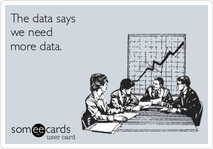
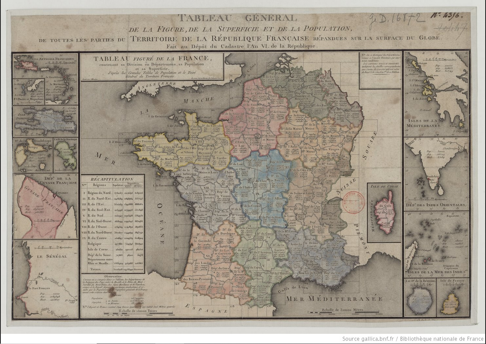
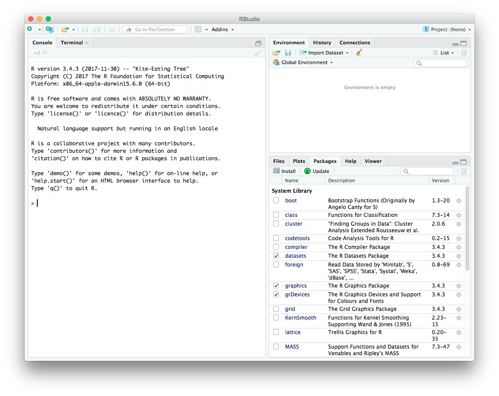

class: inverse, center, middle

```{r setup, include=FALSE}
options(htmltools.dir.version = FALSE)
knitr::opts_chunk$set(fig.retina=2)
# 
# library(Cairo)
# library(cairoDevice)
library(tidyverse)
library(knitr)
library(kableExtra)
```


# Géographie : un tournant numérique ?

```{r, echo = F, fig.align="center", out.width="80%"}


```


---


# Toujours plus de données 

- Ouverture et numérisation des données 

  - des données statistiques : INSEE, UE, communes... 
  - des données picturales : images satellites, photographies aériennes... ;
  - des données textuelles : articles de presse, débats parlementaires, textes législatifs... ;

--

- De nouvelles sources de données numériques
  - réseaux sociaux : Facebook, Twitter, Instagram
  - plateformes : Uber, LeBonCoin, Yelp, Google Maps...
  - projets contributifs : OpenStreetMap, Wikidata...  


---

# Des sciences sociales : un tournant numérique 

- Le développement des Humanités Numériques transforme les champs scientifiques et professionnels

- Roth Camille. 2019. “[Digital, Digitized, and Numerical Humanities.](https://academic.oup.com/dsh/article-abstract/34/3/616/5161109)” _Digital Scholarship in the Humanities_ 
- Ash J, Kitchin R, Leszczynski A. 2018. “[Digital turn, digital geographies ?](https://journals.sagepub.com/doi/10.1177/0309132516664800)” _Progress in Human Geography_
  - Le déploiement des instruments numériques dans les pratiques de recherche conduit à un renouvellement des problématiques de modélisation et de visualisation des phénomènes géographiques ; 
  - Les données numériques (contenus du web, traces numériques) pour appréhender des comportements et dynamiques spatiales ;
  - Le rôle du numérique dans la transformation des territoires.
---

# Des sciences sociales : un tournant numérique 

_Computational Social Science_ & _Digital Trace Data_

<blockquote>
We live life in the network. We check our e-mails regularly, make mobile phone calls from almost any location, swipe transit cards to use public transportation,and  make  purchases  with  credit cards. Our movements in public places may be captured by video cameras, and our medical records stored as digital files. We may post blog entries accessible to anyone, or maintain friendships through online social networks. Each of these transactions leaves digital traces that can be compiled into comprehensive pictures of both individual and group behavior, with the potential to transform our understanding of our lives, organizations, and societies.
.right[-- <cite>D. Lazer, 2009, _Science_</cite>]
</blockquote>

---


# La géographie quantitative

Compter, classer, mesurer, modéliser : geste quantitatif au coeur de la géographie

--
- cartographie


```{r, echo = F, fig.align="center", fig.cap = "Une des premières cartes statistiques (1798)", out.width="60%"}


```

--
---

- analyse spatiale

<blockquote>
Everything is related to everything else, but near things are more related than distant things.right[-- <cite>W. Tobler, 1970, _Economic Geography_</cite>]
</blockquote>
---

### Années 1950-1960 : révolution quantitative

--
- Une science nomothétique : recherche des lois générales de l'organisation de l'espace
- Une science explicative : modélisation 
- Une science appliquée : essor de la _regional science_, de l'économétrie spatiale

--

### Années 2010 : tournant "digital" de la géographie quantitative

- Nouveaux jeux de données avec numérisation des sociétés  
- Rencontre avec d'autres sciences : Data Science, CSS 
- Vers la "Spatial Data science" ou "Geographical Data Science" ?
- Arribas-Bel, D, 2018. “[Geography and Computers: Past, Present, and Future](https://onlinelibrary.wiley.com/doi/abs/10.1111/gec3.12403)” _Geography Compass_.

---
class: inverse, center, middle

# Le logiciel R

---

# Un logiciel couteau-suisse

- R est un langage de programmation.

- Un très large panel d'outils pour les sciences sociales
  - visualisation de données ( _data viz_) ;
  - statistiques ;
  - cartographie ;
  - SIG ;
  - _machine learning_ ;
  - analyse de réseaux ;
  - analyse textuelle ; 
  - présentation visuelle ; 
  - rédaction de mémoires, de rapports...

--

- Un pont vers les autres disciplines : sociologie, économie, sciences politiques _etc_.

---

# Un outil tout-en-un

```{r, echo = F, fig.align="center", out.width="90%"}

include_graphics("img/data-science-workflow.png")
```

---

# Un garant de reproductibilité 

- Si vous travaillez sur R, n'importe qui peut reproduire votre travail = transparence

--

- Suppression des fichiers intermédiaires (texte, figure, mise en page) = gain de temps.

--

- Générer à volonté des analyses assorties de visualisations claires = diffusion.


---

# Une communauté d'utilisateurs

- Un logiciel open source : gratuit, collaboratif 

- Très large bibliothèque de *packages* disponible sur le *The Comprehensive R Archive Network* (CRAN).

- Des ressources en ligne :
  - [Introduction à R et au *tidyverse*](https://juba.github.io/tidyverse/index.html), de Julien Barnier
  - [utilitR](https://www.utilitr.org/), de l'INSEE
  - [Rzine](https://rzine.fr/), du CIST
  - [Geocomputation with R](https://geocompr.robinlovelace.net/), de Lovelace, Nowosad et Muenchow
  - [Data Visualization : A practical introduction](https://socviz.co/), de Kieran Healy

  
  
```{r eval=FALSE, tidy=FALSE, echo = F}
devtools::install_github("yihui/xaringan")
```

---

# Les objectifs de ce cours


Formation aux méthodes et normes de la statistique et de la visualisation (dont cartographique) par la _pratique_ du code dans l'environnement RStudio.

1. La géographie dans un tournant numérique: premier saut dans R.
2. De la donnée à l'information statisitique: mise en forme.
3. Décrire et résumer l'inforation statistique. 
4. Modéliser une relation entre variables. 
5. Données spatiales et information géographique. 
6. Cartographier une distribution. 
7. Modélisation spatiale. 
8. Rattraper notre retard ! 


---
class: inverse, center, middle

# Les statistiques avec R : éléments généraux de définition et manipulations élémentaires 

---

## Découvrir R Studio

--

### Démarrer RStudio depuis le bureau

```{r, echo = FALSE, fig.align = "center", out.width = "75%"}


# include_graphics(img/50318_1516370386_scr.jpg)
```

---
## La console : une grosse calculette

- Additioner/Multiplier/Diviser 5 et 4 ; 
- Utiliser la touche `Entrée` pour valider la commande

---
## L'éditeur de code 

### Une partition 

- Fichier texte qui regroupe l'ensemble des commandes à exécuter (différents formats)
- Utilité : garder trace de tout ce que l'on a effectué. 
- Script : garant de la reproductibilité. 
- Créer un fichier de code : sélectionner le menu `File`, puis `New file` et `R Markdown`
---

### Le Markdown: à la fois script, bloc-note et fenêtre graphique

- Un outil tout-en-un pour : 
  - prendre des notes
  - coder 
  - afficher et mettre en forme les résultats de l'analyse
  - communiquer son travail en HTML ou PDF
  

```{r, echo = FALSE, fig.align = "center", out.width = "70%"}

include_graphics('img/rmd.png')

```

---

- Pour être réutilisable et communicable, un script doit être structuré, aéré, commenté
  - Compléter l'entête du .rmd
  - Enregistrer le .rmd
  - Insérer un premier titre et un sous-titre
  - Insérer un bloc de code (chunk)


---

# Les statistiques


## Eléments de définition

- des données numériques, collectées par une institution publique/privée, ou par vous même...


- des méthodes mathématiques, où on peut distinguer deux branches : 

--

    - la _statistique descriptive_ : résumer l'information sur un ensemble d'éléments
    - la _statistique inférentielle_ : généraliser à de grands ensembles d'éléments des résultats obtenus sur un  échantillon. 


---

# Les notions fondamentales

### Vocabulaire

- Population : l'ensemble des éléments (unité statistiques, individus)
- Individu : tout élement de la population (élement)
- Effectif : efectif total d'une population ou d'un échantillon

### Conventions d'écriture

- _N_ : le nombre d'individus (ex : _n_ =25)
- i : indice qui sert à répérer un individu


--

### Décrire les données

- **Variable** : propriété commune à tous les individus
- **Modalité** : valeur possible pris par une variable

---

# Les types de variable : 2 groupes principaux

```{r, echo = F, fig.align="center", out.width="80%"}

include_graphics("img/TypedeCaractere.jpg")

```
---


# Les types de données dans R


- **numeric** : valeurs décimale (10.1)
- **integer** : nombre entier (10)
- **logical** : valeurs booléennes (TRUE, FALSE)
- **characters** : du texte (aussi appelé *string*). Pour déclarer une donnée de type texte, il faut utiliser les "quotation marks"


---

## L'opérateur d'assignation : `<-` 

Création d'un objet x de type numérique
```{r, echo = T, warning=FALSE, eval=T}

x <- 12
# Quel type d'objet ?
class(x)
#Exécution
x
```

---
## L'opérateur d'assignation : `<-` 

Création d'un objet y de type **character**
```{r, echo = T, warning=FALSE, eval=T}
y <- "Bob"
# Quel type d'objet ?
class(y)
#Exécution
y
```

---

# La structure des données 

## Le tableau élémentaire

- Un tableau qui décrit un ensemble d'individus à l'aide d'un ensemble de variables ;
- Les lignes correspondent aux individus ;
- Les colonnes aux variables ; 
- La première colonne est généralement réservé à un **identifiant**.


---

# La structure des données dans R


## Le vecteur

Un vecteur est une liste d'éléments étant tous du même type.

Création d'un vecteur avec la fonction *c()*: 

```{r, eval = FALSE, echo = T}
monVecteur <- c(objet1, objet2, objet3)
```

On peut accéder aux éléments d'un vecteur en utilisant le signe [ ]. 

```{r, echo = T, eval = T}
x <- c(10, 1000, 200) 
x[3]
```

Une opération menée sur un vecteur s'applique à tous ses éléments : 
```{r, echo = T, eval = T}
x/10
```

---
## Exercice

- Stockez dans un vecteur `distance` les valeurs suivantes exprimées en mètres : 

```{r, eval = FALSE, echo = T}
57069 , 91629 , 54953 , 46444,53158 ,22099 ,14570, 55856
```


- Créez un nouveau vecteur  `distance.km` qui stocke ces distances en kilomètres
- Stockez la 4e valeur du vecteur `distance` dans un nouvel objet `distance.4`
- Remplacez la 4e valeur du vecteur `distance` par la valeur `12`
- Assignez une valeur manquante à la 2e valeur du vecteur `distance` (NA)

---
## Solution 

- Stockez dans un vecteur `distance` les valeurs suivantes exprimées en mètres : 

```{r, eval = FALSE, echo = T}
distance <- c(57069 , 91629 , 54953 , 46444,53158 ,22099 ,14570, 55856)
```
- Créez un nouveau vecteur  `distance.km` qui stocke ces distances en kilomètres
```{r, eval = FALSE, echo = T}
distance.km <- distance/1000
```
- Remplacez la 4e valeur du vecteur `distance` par la valeur `12`
```{r, eval = FALSE, echo = T}
distance[4] <- 12
```
- Assignez une valeur manquante à la 2e valeur du vecteur `distance` (NA)
```{r, eval = FALSE, echo = T}
distance <- NA
```

---

# Le tableau élémentaire

C'est un ensemble de vecteurs !

```{r , message = FALSE, warning = FALSE, echo = FALSE}
library(gapminder)
library(dplyr)
library(kableExtra)
      
gapminder %>% filter(year == 2007) %>% distinct(country, .keep_all = T) %>% sample_n(10, replace = TRUE) %>%  
  rename(Pays = country, Annee = year, Continent = continent, Esperancedevie = lifeExp, Population = pop, PIBparhabitant = gdpPercap) %>%
  knitr::kable(format = 'html') %>%
    kable_styling(bootstrap_options = "striped", full_width = F, font_size = 16) %>%
   footnote(general  = "Gapminder", general_title = "Source : ", footnote_as_chunk = T)

```

---

# **Le data.frame**

Création d'un data.frame avec la fonction `data.frame()`

```{r, eval = T, echo = T}
# 3 vecteurs
ville <- c("Rome", "Paris", "Londres")  #création vecteur
population <- c(2873000, 2141000, 8136000)
etat <- c("Italie", "France", "Royaume-Uni")
# 1 data.frame
df <- data.frame(ville, population, etat, 
                 stringsAsFactors = F) #création 
df
```

---

## Dimensions d'un data.frame

```{r, eval = T, echo = T}

class(df) #classe de l'objet
dim(df) #dimension
nrow(df)#nombre de lignes
ncol(df) #nombres de colonnes
```
---

## Manipulation  d'un data.frame

- Accès à une colonne avec le signe $ + TAB pour afficher les colonnes disponibles

```{r, eval = T, echo = T}
df$population
```

- Création d'une colonne 

```{r, eval = T, echo = T}
df$PopMillier <- df$population/1000
df$PopMillier
df$Type <- "Capitale"
df$Type
```

---

# Exercice 

Décrivez le tableau suivant :

```{r , message = FALSE, warning = FALSE, echo = FALSE}
library(gapminder)
library(dplyr)
library(kableExtra)
      
gapminder %>% filter(year == 2007) %>% distinct(country, .keep_all = T) %>% sample_n(10, replace = TRUE) %>%  
  rename(Pays = country, Annee = year, Continent = continent, Esperancedevie = lifeExp, Population = pop, PIBparhabitant = gdpPercap) %>%
  knitr::kable(format = 'html') %>%
    kable_styling(bootstrap_options = "striped", full_width = T, font_size = 16) %>%
   footnote(general  = "Gapminder", general_title = "Source : ", footnote_as_chunk = T)
```


---
class: inverse, center, middle


## Importer des données dans R

- Un fichier au format csv (le plus courant) :

```{r, eval = FALSE, echo = T, tidy = T}
df <-  read_csv(file="c:/MonTableau.csv", header=TRUE, sep=",")
```

- Un fichier au format excel :

```{r, eval = FALSE, echo = T, tidy = T}
df <- read_excel(path = "c:/MonTableau.xlsx", sheet = 1, col_names = TRUE)
```

- Voir par exemple [Import de données dans RStudio](http://larmarange.github.io/analyse-R/import-de-donnees.html)

---
# Les fonctions

- Une fonction a un **nom**, elle prend en entrée des **arguments** (ou paramètres) et des objets en _input_, et retourne un résultat (ou _output_)

- On peut stocker le résulat d'une fonction dans un objet :

```{r, eval = F, echo = T}
nouvelObjet <- function(objet, paramètres)
```

- Souvent, les fonctions prennent le nom d'un verbe en anglais. Par exemple, la fonction `length` renvoie le nombre d'élements d'un vecteur :

```{r, eval = F, echo = T}
length(distance)
```

---
# Exercice


- Avec le vecteur `distance.km`, calculez la distance minimale, la distance maximale et la distance moyenne

- Avec le vecteur `distance`, calculer la moyenne.


---
# Solution


- Avec le vecteur `distance.km`, calculez la distance minimale, la distance maximale et la distance moyenne

```{r, eval = F, echo = T}
min(distance.km)
max(distance.km)
mean(distance.km)
```

- Si je veux stocker le résultat de ce calcul, il faut utiliser "<-" !
```{r, eval = F, echo = T}
distanc.min <- min(distance.km)
```

- Avec le vecteur `distance`, calculer la moyenne.
```{r, eval = F, echo = T}
mean(distance) #renvoie une valeur NA
```
- Il faut donc spécifier un argument pour enlever les valeurs manquantes lors du calcul
```{r, eval = F, echo = T}
mean(distance na.rm = T) # = na.remove = TRUE
```
---


# Exercice

 
  - Importer le fichier csv `murders`. 
  - Calculer avec une fonction le nombre total de meurtres aux Etats-Unis.
  - Calculer le nb de meurtres pour 100 000 habitants. 
  - Identifier la plus forte et la plus faible valeur. 
  - Calculer l'étendue de la distribution (maximum-minimum).
  - Chacune des étapes doit être correctement mise en forme et commentée dans le Markdown. 

---

# Exercice

Choisir un jeu de données ouvertes disponible en ligne et l'importer. 

---

class: center, middle

# Merci !

Slides crées avec le package [**xaringan**](https://github.com/yihui/xaringan).
D'après [jmigozzi/statsmappingwithR](https://github.com/jmigozzi/statsmappingwithR)

