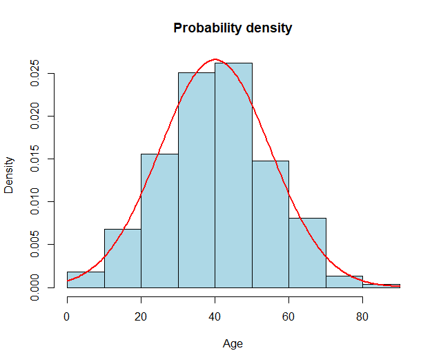
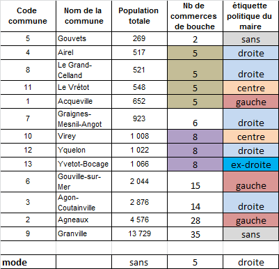
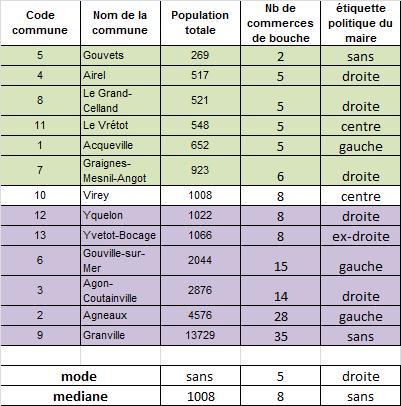

class: inverse, center, middle

```{r setup, include=FALSE}
options(htmltools.dir.version = FALSE)
knitr::opts_chunk$set(fig.retina=2)
# 
# library(Cairo)
# library(cairoDevice)
library(tidyverse)
library(knitr)
library(kableExtra)
```


# Résumer l'information statistique

--
En présence d’un vaste ensemble de données numériques, besoin de simplifier et de représenter l'information :


- construire des graphiques (histogramme,  camembert,  etc.)
- déterminer les valeurs centrales (moyenne, médiane, etc.)
- évaluer la dispersion (écart-type,variance, intervalle interquartile, etc.) 

Comparer des séries statistiques => statistique descriptive. 

---

# Représenter les séries statistiques

--
à partir d'un tableau de dénombrement

- Variable qualitative nominale


```{r, echo = F, fig.align="center", out.width="100%"}

include_graphics("img/qalinom.png")
```

---

- Variable qualitative ordinale


```{r, echo = F, fig.align="center", out.width="100%"}

include_graphics("img/qualiord.png")
```


---

- Variable quantitative


```{r, echo = F, fig.align="center", out.width="100%"}

include_graphics("img/quanticlass.png")
```


---
à partir d'un caractère ordonné

--

- Fréquences cumulées


```{r, echo = F, fig.align="center", out.width="100%"}

include_graphics("img/freqcu.png")
```

---

- Fonction de probabilité de densité


```{r, echo = F, fig.align="center", out.width="100%"}


```

---

# Les valeurs centrales

Les valeurs centrales permettent de résumer par une seule valeur, l’ensemble des valeurs d’une distribution statistique. 
Elles donnent un *ordre de grandeur* de la distribution.
Il existe 3 valeurs centrales : 
- le mode
- la médiane
- la moyenne

La comparaison de ces valeurs centrales permet de déterminer la forme de la distribution observée.

---

## Le mode

Le mode, ou valeur dominante, est la valeur la plus fréquente d'une distribution.
- Se calcule toujours à partir d'un dénombrement des modalités du caractère. 
- Il faut cependant distinguer le cas des caractères discrets et celui des caractères continus.

--

Pour un caractère qualitatif ou pour un caractère quantitatif discret (ayant un nombre de modalités
inférieur au nombre d'éléments), le mode est la modalité qui a la fréquence simple la plus élevée (ou l'effectif le plus élevé, ce qui revient au même).
---

```{r, echo = F, fig.align="center", out.width="70%"}


```
---

Pour un caractère quantitatif continu, les modalités sont en nombre infini
(il est peu probable que deux éléments aient la même valeur),le mode ne peut pas être défini directement: 

- Il faut établir une partition en classes (tableau de dénombrement) : la classe modale est alors celle dont la fréquence moyenne est la plus élevée.

- C'est la classe où les valeurs sont le plus concentrées mais pas toujours celle qui comporte le plus d'individus.

- Le mode est obtenu en prenant le centre de la classe modale, c'est à dire la moyenne de ses bornes supérieure et inférieure.
---


```{r, echo = F, fig.align="center", out.width="100%"}

include_graphics("img/classe_mod.png")
```
---

Lorsque l'histogramme d'une distribution présente deux pics séparés par un creux, on
dit que la distribution est bimodale.

On distingue alors un mode principal et un mode secondaire.

```{r, echo = F, fig.align="center", out.width="100%"}

include_graphics("img/bimod.png")
```

---

## La médiane (caractères quantitatifs)

La médiane est la valeur du caractère qui partage l'ensemble décrit par caractère en deux sous ensembles d'effectifs égaux :

- 50 % des éléments ont des valeurs supérieures à la médiane et 50% prennent des valeurs inférieures.

- Si la distribution a un nombre impair d'éléments on trouve une valeur unique qui est la médiane.
- Si la distribution a un nombre pair d'éléments, on trouve deux valeurs qui déterminent un intervalle médian. La médiane est alors le centre de cet intervalle médian.
---

```{r, echo = F, fig.align="center", out.width="70%"}


```

---
*Propriétés de la médiane.*

La médiane est la valeur du caractère qui est la plus proche de toutes les autres. Elle minimise les distances en valeur absolue. 

Elle est souvent utilisé en géographie pour déterminer des localisations optimales, c'est à dire des emplacements dotés de la meilleure accessibilité possible (minimisation de la distance d'un
point à tous les autres)

---

## La moyenne

La moyenne simple est égale à la somme des valeurs divisée par le nombre d'éléments.
C’est le centre de gravité d’une distribution, elle a une signification physique.

La moyenne est sensible aux valeurs extrêmes: si l'on supprime l'individu qui a la valeur maximale ou minimale, elle change fortement. Ce n'est pas le cas de la médiane ou du mode qui sont plus robustes. 

---

## Valeurs centrales et formes des distribution


```{r, echo = F, fig.align="center", out.width="80%"}

include_graphics("img/distrib.png")
```

Ex: comparer la forme de la distribution des revenus dans un ensemble de pays. 

---

# Paramètres de dispersion 

On appelle paramètre de dispersion une mesure du degré de proximité ou d’éloignement des valeurs de cette distribution.
Les paramètres de dispersion complètent le premier résumé apporté par les valeurs centrales.

On distingue la dispersion absolue (mesurée dans l'unité de mesure du caractère) et la dispersion relative (mesurée par un nombre sans dimension).
---

## Dispersion absolue

---
### Etendue

On appelle étendue d’une distribution la plus grande distance entre deux valeurs d’une distribution. C’est la différence entre le maximum et le minimum.

- Etendue(X) = Max(X) Min (X)

Ex: comparer l'étendue des salaires dans plusieurs entreprises.

---
### Quantiles

On appelle quantiles d’une distribution les valeurs qui permettent de découper cette distribution en n classes d’effectifs égaux .
Si découpage en 4 classes on appelle quartiles d’une distribution les trois valeurs Q1,
Q2 et Q3 qui permettent de découper cette distribution en quatre classes d’effectifs égaux.

Min (25%) Q1 (25%) Q2 (25%) Q3 (25%) Max

- 4 classes = quartiles
- 5 classes = quintiles
- 10 classes = déciles
- 100 classes = centiles

---

### Intervalles inter-quantiles

On appelle intervalle Inter Quantile l’étendue de la distribution qui regroupe un certain pourcentage des valeurs au centre de la distribution, une fois éliminé les valeurs les plus faibles et les valeurs les plus fortes de la distributions.

- Si découpage en 4 classes, intervalle interquartile (Q3 Q1) l’étendue de la distribution qui regroupe 50% des valeurs une fois qu’on a élimine les 25% des valeurs les plus faibles et les plus fortes.

Int. Interquartile (X) = Q3(X) - Q1(X)

- Si découpage en 10 classes, intervalle interdécile (D9 D1) l’étendue de la distribution qui regroupe 80% des valeurs au centre de la distribution une fois qu’on a éliminé les 10% des valeurs les plus faibles et 10% des valeurs les plus fortes.

Int. Interdécile (X) = D9(X) - D1(X)


---
### Dispersion autour de la moyenne

L’écart absolu moyen est la moyenne des distances à la moyenne.

L’écart type est la racine carrée de la variance.
La variance est la moyenne des carrés des écarts à la moyenne.

L’écart type est intéressant lorsque les distributions sont « Gauss normales » (unimodales et symétriques).

Dans ce cas on peut définir des probabilités de dispersion autour de la moyenne : 

- 68% des valeurs se situe entre 1 et +1 écart type
- 95% des valeurs à moins de 2 et +2 écart type
- 99.7% des valeurs à moins de 3 et +3 écart type

---
## Dispersion relative

La comparaison des paramètres de dispersion absolue de deux caractères n'a de sens que si les 
deux caractères sont de même nature et de même ordre de grandeur.

Dans le cas contraire, la comparaison n'est possible qu'en ayant recours à des mesures de dispersion relative. 

On le calcule en divisant le paramètre de dispersion absolue par la valeur centrale qui lui sert de référence.

On obtient un nombre sans unité de mesure qui peut être exprimé en %.

--

Coefficient de variation (C.V.): Ecart type / moyenne

Ecart moyen relatif: écart absolu moyen / moyenne

Coefficient interquartile relatif: intervalle interquartile absolu / médiane

---
# *Interprétation géographique*


```{r, echo = F, fig.align="center", out.width="100%"}

include_graphics("img/dispersion_spatiale.png")
```


---
# Avec R. 

- Manipuler avec les verbes _dplyr_
- Visualiser avec le package _ggplot2_
- Résumer les variables avec _summary()_ et _table()_ 

---

# Représenter une distribution

```{r out.width = '40%'}

mydata <- read.csv("C:/Users/romai/Documents/ens_ulm/cours/STATR/statsmappingwithR-master/statsmappingwithR-master/03_DataSummary/data/idf_pse.csv")


library(ggplot2)

```

---

```{r out.width = '40%'}

# Courbe de densité
ggplot(mydata, aes(x=POP2008)) + 
  geom_density()+

# Ajouter la ligne de la moyenne
  geom_vline(aes(xintercept=mean(POP2008)),
            color="blue", linetype="dashed", size=1)+
  #médiane
    geom_vline(aes(xintercept=median(POP2008)),
            color="red", linetype="dashed", size=1)+
  
  # Habiller le graphique
      ylab("Densité de probabilité")+
  xlab("Population communale en 2008")+
  ggtitle("Distribution de la population communale en Ile de France")

```

---
# Histogramme

```{r out.width = '40%'}

ggplot(mydata, aes(x = POP2008))+
  geom_histogram(binwidth = 10000)

```

---
# Fréquences cumulées

```{r out.width = '40%'}
ggplot(mydata, aes(x= POP2008)) +
    geom_line(stat="ecdf")+
    ylab("Fréquences cumulées (%)")+
  xlab("Population communale en 2008")+
  ggtitle("Distribution de la population communale en Ile de France")
```

---
# Diagramme en barres

```{r  out.width = '40%'}
mydata <- mydata %>% 
  mutate(DEPT = substr(CODGEO, 1,2))

ggplot(mydata, aes(x = DEPT))+
  geom_bar()+
  ylab("Nombre de communes")+
  xlab("Départements")

```


---
# La boîte à moustaches

_ggplot_ met en évidences les valeurs supérieures à Q3 + 1,5 fois l'intervalle interquartile
et inférieures à Q1 + 1,5 fois l'intervalle interquartile (outliers)

```{r out.width = '40%'}
ggplot(mydata, aes(x = POP2008, y = DEPT))+
  geom_boxplot()
```


---

# Comparer la distribution de variables


- La fonction _summary()_ renseigne sur la distribution d'une variable quantitative (format _numeric_ ou _integer_) :

```{r,eval= F}
summary(mydata$POP2008)
```

- Les fonctions _mean_, _median_, _quantile_

```{r}
quantile(mydata$POP2008, probs = c( 0.1, 0.9))

median(mydata$POP2008)

```

---

- La fonction _table()_ renseigne sur la distrbution d'une variable discrète :

```{r, eval= F}
table(mydata$DEPT)

table(mydata$TXCHOMA07)
```

---
## La fonction _table_ : calculer des fréquences et le mode

On peut stocker le résultat de la fonction _table()_ dans un _data.frame_, où : 

  - une colonne "Var1" stocker les modalités de la variable (variable quali) ; 
  - une colonne "Freq" stocke la fréquence de chaque modalité (variable quanti) ; 
  - chaque ligne correspond à une modalité.

Ici, 4 départements différents, donc on obtient un tableau de 4 lignes.

```{r,  eval= F}
eff_departements <- as.data.frame(table(mydata$DEPT))

```


---
# Paramètres de dispersion

```{r}
# Etendue
max(mydata$POP2008) - min(mydata$POP2008)

# Ecart interquartiles
IQR(mydata$POP2008)

#ou 
quantile(mydata$POP2008, 0.75) - quantile(mydata$POP2008, 0.25)

# Ecart absolu moyen
mean(abs(mydata$POP2008 - mean(mydata$POP2008)))

# Coefficient de variation
sd(mydata$POP2008)/mean(mydata$POP2008)*100
```
---
# Exercice. Homogénéité et hétérogénéité spatiale

1. Comparer et interpréter les distributions statistiques de la population communale en 1936, 1968, 1990 et 2008.

2. Comparer et interpréter les distributions du revenu fiscal médian communal dans les 4 départements franciliens. 


---


class: center, middle

# Merci !

Slides crées avec le package [**xaringan**](https://github.com/yihui/xaringan).

