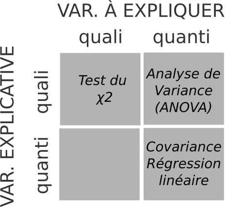

class: inverse, center, middle

# Rappel


```{r setup, include=FALSE}

# options(htmltools.dir.version = FALSE)
# knitr::opts_chunk$set(fig.retina=2)
#knitr::opts_chunk$set(cache = F)
# 

# library(Cairo)
# library(cairoDevice)
# load("my_work_space.RData")
library(tidyverse)
library(knitr)
library(kableExtra)
# library(sf)
# library(spData)
# library(mapview)
# library(tmap)
# library(cartography)
library(viridis)
# library(raster)
library(ggthemes)
library(hrbrthemes)

# mydata <- st_read(dsn = "02_SpatialData/data/parispc_com.shp", 
#                   crs = 2154, 
#                   stringsAsFactors = F)
mydata <- read.csv("C:/Users/romai/Documents/ens_ulm/cours/STATR/statsmappingwithR-master/statsmappingwithR-master/03_DataSummary/data/idf_pse.csv")


# soc_eco$INSEE_COM <- as.character(soc_eco$CODGEO)

# mydata <- left_join(mydata, #objet 1 : l'objet sf
#                     soc_eco, #objet 2 : le data.frame
#                     by = "INSEE_COM") # l'identifiant commun

# movies_paris <- st_read(dsn = "03_DataWrangling/data/lieux-de-tournage-a-paris/lieux-de-tournage-a-paris.shp", 
#                         crs = 4326, 
#                         stringsAsFactors = F)


options(tidyverse.quiet = TRUE)
```


---
## La statistique descriptive

- Ouvrir, explorer et manipuler des données spatiales sous R ; 

<br>

- Décrire une distribution statistique : 
  - pour une variable *catégorielle* : 
      - regarder la **fréquence** avec un tableau de dénombrement ; 
      - **visualiser** (diagramme en bâton).
  - pour une variable *quantitative*, regarder : 
      - les mesures de **position** (moyenne, mediane) et de **dispersion** (variance, écart-type); 
      - **visualiser** la distribution (histogramme, *boxplot*).
      - discrétiser.


---
class: middle, center, inverse

# De l'univariée à l'analyse bivariée

## Vers la modélisation

---
### Statistiques bivariée

- Analyse et à représentation d'une variable : **statistique univariée**. 

- Indicateurs et visualisation : charpente de la statistique & prélude indispensable à toute cartographie de données.

<br>
--
<br>

- Statistique **bivariée** : étude des *relations* entre deux variables, quelles soient qualitatives ou quantitatives. 

--

- La statistique bivariée consiste à analyser la relation entre deux variables, c'est à dire à mesurer comment ces deux variables *covarient*, à identifier des dépendances. 


---
### Vers la modélisation 

- C'est une première étape vers la modélisation : *expliquer*, voire de *prédire* le réel par le biais d'un modèle mathématique résumant la relation entre deux variables. 


- Cette modélisation mathématique repose sur : 
  - une **variable à expliquer**, dite aussi variable dépendante, *target*, *responsable variable*...
  - une **variable explicative**, dite aussi variable indépendante, *regressor*, *covariate*, *feature*...

--
  
- Expliquer *Y* en fonction de *X* revient à proposer une équation : 

$$y = f(x)$$
---
### Modèle : mesurer une relation statistique


- Il s'agit de confronter des données empiriques (collectées sur le terrain, acquises auprès d'un fournisseur) à des données théoriques, produites par un modèle, puis déterminer l'importance de l'**écart** entre données empiriques et théoriques.

- Plus l'écart entre données et modèle est petit, plus la relation entre les deux variables est forte, *sans que l'on puisse parler de causalité*. On quantifie seulement l'intensité de la relation. 

- L'analyse des relations statistiques doit s'inscrire dans un cadre théorique explicatif.


---
### Variables, relations et choix du modèle

Le modèle à employer pour étudier une relation dépend du type de variables.

<br>

```{r, fig.align="center", echo = F, out.width="40%"}

```
.center[ .tiny[Graphique inspiré de [Hadrien Commenges](https://gitlab.huma-num.fr/hcommenges/cours_statcomplet)]]

--


   <br> 
.center[.content-box-red[Choix des variables et du modèle : question scientifique]]
  <br>
  
  
---
class: center, middle, inverse

# Analyser une relation bivariée

## Visualisation, covariance corrélation

---
### Visualisation

On utilise un *scatter plot*, ou nuage de points, pour visualiser la relation entre deux variables quantitatives continues. 

```{r, fig.align="center", out.width="55%"}
plot(mydata$POUV07, mydata$PCAD07)
```

---
### Visualisation

Le nuage de points permet de déterminer la relation : 

- l'**intensité**  : *forte*, *faible*, *nulle.*
- la **forme**  : *linéaire*, *non-linéaire*.
- le **sens** : *positive*, *négative.* 

<br>

<!-- Selon la forme de la relation observée, on ne fera pas les mêmes hypothèses et on n'utilisera pas les mêmes outils de mesure. -->

```{r, echo = F, out.width= "70%",fig.align="center"}

```
.center[ .tiny[Graphique inspiré de [Hadrien Commenges](https://gitlab.huma-num.fr/hcommenges/cours_statcomplet)]]

---
## Mesurer la relation : covariation et covariance

- On dit qu'il existe une relation entre *X* et *Y* si : 
  - les valeurs de *X* dépendent des valeurs de *Y*  ou 
  - si les valeurs de *Y* dépendent des valeurs de *X.*

<br>
- Deux variables entretiennent une **relation linéaire** entre elles si la variation relative de l'une d'entre elles entraîne une variation relative constante de l'autre .tiny[(O. Martin, 2014)].

<br>

- La **covariance** est une valeur qui permet de connaître dans quelle mesure les variables d'une série statistique évoluent ensemble.

---
## La covariance

.center[La **covariance** est la moyenne du produit des écarts.]


$$cov_{x,y}=\frac{\sum_{i=1}^{N}(x_{i}-\bar{x})(y_{i}-\bar{y})}{N-1}$$

où *N* est l'effectif de la population, $\bar{x}$ la moyenne de *x* et $\bar{y}$ la moyenne de *y*.

--

<br>

**Exercice** : calculez, à l'aide de R, la covariance du taux d'ouvriers en 2007 (x) et 
du taux de cadres en 2007 (y) : 

- calculez les écarts à la moyenne ; 
- calculez le produit des écarts ; 
- calculez la somme du produit des écarts ; 
- calculez la covariance


---
### Solution 

Manuellement, en codant toutes les étapes : 

```{r, echo = T}
xdev <- mydata$POUV07 - mean(mydata$POUV07) #écart à moyenne
ydev <- mydata$PCAD07 - mean(mydata$PCAD07)

xdev_ydev <- xdev * ydev #produit

sum_xdev_ydev <- sum(xdev_ydev) #somme produit

cov_xy <- sum_xdev_ydev / (nrow(mydata) - 1) # moyenne
cov_xy <- sum_xdev_ydev / (143 - 1) # nrow(mydata) = 143

cov_xy
```

---
### Solution 

Avec _dplyr_ : 

```{r}
mydata %>% 
  mutate(EcartOuv = POUV07 - mean(POUV07), 
        EcartCad = PCAD07 - mean(PCAD07)) %>%
    mutate(Produit = EcartOuv*EcartCad) %>%
summarise(SommeProduit = sum(Produit)) %>%
summarise(Cov = SommeProduit / (nrow(mydata) - 1)) 
```

Avec R et la fonction *cov*() : 
```{r}
cov(mydata$POUV07, mydata$PCAD07)
```


---
### De la covariance à la corrélation

La covariance n'a pas beaucoup de signification en elle-même puisqu’elle dépend des unités de mesure.  

<!-- - La covariance se calcule avec des écarts à la moyenne : ne dépend donc pas de l’ordre de grandeur de la variable. -->
<!-- - La covariance est une moyenne (somme rapportée à l’effectif) : ne dépend donc pas du nombre d’observations. -->
<!-- - La covariance dépend de la variation (dispersion) des deux variables autour de la moyenne : on neutralise cet effet en la rapportant au produit des écart-types des deux variables.  -->

- On *standardise la covariance* en la rapportant au produit des écarts-types. La formule est la suivante : 

$$R = \frac{\text{cov}(X,Y)}{\sigma_x \sigma_y}$$
où $\sigma_y$ est l'écart type de *y*, soit la racine carré de la variance de *y.*

- *R* est dit coefficient de Bravais-Pearson, coefficient de Pearson, ou encore **coefficient de corrélation**.

---
## Les coefficients de corrélation : Pearson


- Le coefficient de Pearson permet de détecter la présence ou l'absence d'une relation linéaire entre deux caractères quantitatifs continus.

<br>

- Il **varie entre -1 et +1**. 

<br>

- Son interprétation est la suivante :

  - R proche de 0 : pas de relation linéaire entre *X* et *Y*.
  - R tends vers - 1 :  il existe une forte **relation linéaire négative** entre *X* et *Y*.
  - R tends vers 1 : il existe une forte **relation linéaire positive** entre *X* et *Y*.


---
## Les coefficients de corrélation : Spearman

- Ce coefficient de **corrélation de rang** examine s'il existe une relation entre le rang des observations pour deux caractères *X* et *Y*.

<br>

- Il est préférable au coefficient de Pearson lorsque les distributions *X* et *Y* sont dissymétriques et/ou comportent des valeurs exceptionnelles. 

<br>

- Il est fondé sur l'étude de la **différence des rangs** entre les attributs des individus pour les deux caractères *X* et *Y*.

<br>

- Il **varie entre -1 et +1** : même signification que Pearson.

---
## Les coefficients de corrélation 


```{r, echo = F, out.width= "40%", fig.align="center"}

```
.center[.tiny[Source : [Julien Barnier](https://juba.github.io/tidyverse/04-bivarie.html#calcul-dindicateurs)]]

---
## Bilan des coefficients

<br>
<br>

.center[.content-box-blue[Le signe de *R* (+/-) indique le **sens** de la relation]]
<br><br>
.center[.content-box-blue[La valeur absolue de *R*  indique l'**intensité** de la relation]]
<br>

.center[Intensité de la relation :]

.center[capacité à prédire les valeurs de *Y* en fonctions de celles de *X*.]

---
### Corrélation : application sur R

<br>

On utilise la fonction *cor()*. Cette fonction s'applique sur deux variables, en précisant la méthode souhaitée par l'argument *method*.


### Pearson
```{r, eval = F}
cor(data.frame$X, data.frame$Y, 
    method = "pearson")
```

### Spearman

```{r, eval = F}
cor(data.frame$X, data.frame$Y, 
    method = "spearman")
```

---
### Matrice de corrélation

- Pour plusieurs variables !

- Plusieurs packages existent : 
  - [corrplot](https://cran.r-project.org/web/packages/corrplot/vignettes/corrplot-intro.html) ; 
  - [corrr](https://cran.r-project.org/web/packages/corrr/vignettes/using-corrr.html), compatible avec le *tidyverse*, sorti le 24 novembre 2020. 
  
  
---

---
class: inverse, center, middle

# La régression linéaire

### Le couteau suisse de la modélisation

---
### Une méthode statistique

- Déterminer une droite pour un jeu de données : on parle d'ajuster une droite (*fiting*) à un nuage de points. 

- Modéliser la relation entre *X* et *Y* en traçant une droite. 

- Cette ligne droite se nomme la **droite de régression**.

--

<br>

- La Méthode des Moindres Carrés (MCO) fait partie des techniques de régression les plus connues (*Ordinary Least Squares* en anglais - OLS).

- Il s’agit : 
  1. de calculer la droite des moindres carrés ordinaires, qui minimise le carré des résidus. On obtient donc une équation qui modélise la relation entre X et Y.
  2. d'évaluer la qualité de ce modèle, en mesurant son pouvoir explicatif. 
  3. d'analyser les écarts à ce modèle (les résidus).

---
### Tracer un nuage de points


.left-code[
```{r plot-label1, eval=FALSE}
# Scatter plot

ggplot(mydata, aes(PCAD07, RFUCQ207)) +
  geom_point(size = 4,
             alpha = 0.5) + 
  theme_bw(base_size = 24) +
  labs(x = "% de cadres en 2007", y = "Revenu médian en 2007")

# Corrélation
cor(mydata$PCAD07, mydata$RFUCQ207)
```
]

.right-plot[
```{r plot-label1-out, ref.label="plot-label1", echo=FALSE}
```
]

---
### Visualiser chaque distribution


.left-code[
```{r plot-label2, eval=FALSE}
library(ggExtra)

# Scatter plot
p <- ggplot(mydata, aes(PCAD07, RFUCQ207)) +
  geom_point(size = 4,
             alpha = 0.5) + 
  theme_bw(base_size = 24) +
  labs(x = "% de cadres en 2007", y = "Revenu médian en 2007")

# Marginal boxplot
ggMarginal(p, type = "boxplot", size = 10)

```
]

.right-plot[
```{r plot-label2-out, ref.label="plot-label2", echo=FALSE}
```
]

---
### Tracer une droite


.left-code[
```{r plot-label3, eval=FALSE}
ggplot(mydata, aes(PCAD07, RFUCQ207)) +
  geom_point(size = 4,
             alpha = 0.5) + 
  theme_bw(base_size = 24) +
  labs(x = "% de cadres en 2007", y = "Revenu médian en 2007") +
  geom_smooth(method = "lm")
```
]

.right-plot[
```{r plot-label3-out, ref.label="plot-label3", echo=FALSE, message = F, warning = F}
```
]

---
### Equation de la droite de régression

.center[Formule pour une ligne droite]

$$ \small Y_i = a + bx $$
- X est la variable explicative
- Y est la variable dépendante
- a et b sont des coefficients :  
  - a est l'intersection, soit la valeur de X quand Y = O ; 
  - b est la pente

---
### Equation de la droite de régression


.center[Formule pour un modèle de régression linéaire]

$$ \small \hat{Y_i}= \beta_0 + \beta_1 X_i + \epsilon_i $$
- Xi est la valeur de la variable explicative.
- $\hat{Y_i}$ est la valeur estimée de la variable à expliquer.
- $\beta_0$ est l'intersection (*intercept*)
- $\beta_1$ est la pente, ou le coefficient de régression 
- $\epsilon_i$ est l'erreur aléatoire : le *résidu*.


--

<br>
.center[.content-box-red[Un modèle ?]]

<br>

.center[.content-box-blue[*Data* = *Fit* (ce qui est capturé par le modèle) + *Residual* (ce qui ne l’est pas)]]

---
### Méthode des moindres carrés

.pull-left[
- Objectif : obtenir les plus petits résidus possibles. 

- Méthode : tracer une droite qui *minimise le carré des résidus*. 

- Minimiser les écarts entre la droite (les valeurs prédites par l'équation) et les points (les données empiriques).

- résidu = la différence entre la donnée observée et la donnée prédite par le modèle, soit $\small \epsilon_i = y_i - ax_i - b$
]

.pull-right[
```{r, echo=F, warning=F, fig.align="center", out.width="100%", fig.align="center",  message=F}

model <- lm(RFUCQ207 ~ PCAD07, data = mydata)

mydata$Residuals <- residuals(model)
mydata$Predicted <- predict(model)


ggplot(mydata, aes(x = PCAD07, y = RFUCQ207)) +
   geom_point() +
    geom_smooth(method = "lm", se = FALSE, col = "black", size = 1.5) +  # Plot regression slope

  geom_segment(aes(xend = PCAD07, yend = Predicted), alpha = .5) +  # alpha to fade lines
  geom_point(aes(fill = Residuals), size = 5, shape = 21) +  # Color mapped here 
  scale_fill_gradient2(low = "blue", mid = "white", high = "red") +  # Colors to use here
  theme_bw(base_size = 24) +
  guides(fill = FALSE)  +
  labs(x = "% de cadres en 2007", y = "Revenu médian en 2007") 
```
]

---
### Application sur R

- Utilisation de la fonction *lm()*, pour *linear models*.

<br><br>

.center[lm(Y ~ X, data = df = tableau)]

<br><br>

.center[lm(Y ~ X, data = data.frame *ou* objetsf)]

<br><br>
.center[lm(RFUCQ207 ~ PCAD07, data = mydata)]

---
### Application sur R


```{r}
lm(RFUCQ207 ~ PCAD07, data = mydata)
```


- La valeur de l'intercept, ou $\beta_0$, est 10476.
- La valeur de la pente, ou $\beta_1$, est 432.
- On obtient la formule suivante :


$$\tiny \operatorname{RFUCQ207} =  \beta_0 + \beta_{1}(\operatorname{PCAD07}) + \epsilon$$
Soit : 

$$\tiny \operatorname{RFUCQ207} = 10476 + 432(\operatorname{PCAD07}) + \epsilon$$


```{r, echo = F, eval = F, include = F}
# Calcul modèle

model <- lm(RFUCQ207 ~ PCAD07, data = mydata)
summary(model)
equatiomatic::extract_eq(model)
equatiomatic::extract_eq(model, use_coefs = T)


```


---
### Visualiser le modèle 

.left-code[
```{r plot-label4, eval=FALSE, warning=F, message = F}

# Valeur estimée
mydata <- mydata %>% 
  mutate(RevenusPredict = 10476+432*PCAD07)

 #Modèle
ggplot(mydata, aes(x = PCAD07, 
                   y = RevenusPredict)) +
  #valeurs prédites
geom_point(fill = "black", 
           size = 4, shape = 21) + 
  # écarts
  geom_segment(aes(xend = PCAD07, 
                   yend = RFUCQ207), 
             alpha = .5) + 
  
  # Données empiriques
geom_point(data = mydata, aes(PCAD07,RFUCQ207, 
                              fill = Residuals), 
           size = 5, 
           shape = 21) + 
  # droite de régression
geom_smooth(data = mydata, 
            aes(PCAD07,RFUCQ207),
            method = "lm", 
            se = F,
            col = "red") + 
  #couleurs pour résidus
scale_fill_gradient2(low = "blue", 
                     mid = "white", 
                     high = "red") + 
  
  #habillage
theme_bw(base_size = 24) +
guides(fill = FALSE)  +
labs(x = "% de cadres en 2007",
     y = "Revenu médian en 2007") 
```
]

.right-plot[
```{r plot-label4-out, ref.label="plot-label4", echo=FALSE, message = F, warning=F}
```
]

---
### Interprétation

$$\tiny \operatorname{RFUCQ207} = 10476 + 432(\operatorname{PCAD07}) + \epsilon$$


- Quand X augmente d'une unité, Y augmente de $\beta_{1}$ unité, au dessus de la valeur constante $\beta{0}$.

- Quand le pourcentage de cadre augmente de 1% (X), le revenu médian augmente de 432 unités (Y), au dessus de la valeur 10476.

- Quel serait le revenu estimé pour un taux de 40% et 41 % ?

--

```{r}
a <- predict(model, data.frame(PCAD07 = c(40, 41)))
a

a[2] - a[1]

```


---
class: middle, inverse, center

# Estimer un modèle

### Coefficient et résidus

---
### Quantifier l'ajustement d'un modèle 

- Le rapport entre variance de la variable estimée et variance de la variable observée permet de quantifier le pouvoir explicatif du modèle.

- Ce rapport est noté $R^2$ : c'est le coefficient de détermination. Il est égal au carré du coefficient de corrélation (cf *pearson*).

- Il peut être interprété comme une pourcentage de la variance expliquée : “*le modèle explique 65% de la variation de la variable étudiée*”.

---
### Calculer un R2 


$$ \tiny R^2 = \frac{VAR(y_e)}{VAR(y)} = 1 - \frac{VAR(\epsilon)}{VAR(y)} $$

```{r}
# Somme des résidus au carré
sum_res <- sum(mydata$Residuals^2)
# Moyenne de Y
mean_y <- mean(mydata$RFUCQ207)
# Ecart à la moyenne au carré
ecart <- (mydata$RFUCQ207 - mean_y)^2
# R2 = somme des résidus / somme des écarts
1 - sum_res / sum(ecart)

```

.center[Le pourcentage de cadres explique 77% de la variance du revenu médian.]

---
### Application sur R 

```{r}
model <- lm(RFUCQ207 ~ PCAD07, data = mydata)

summary(model)
```


---
### Vérifier le modèle

- Le modèle de régression linéaire simple repose sur plusieurs hypothèses. 

- Normalité : les résidus doivent avoir une distrubution normale normalement répartis, donc avoir une distribution normale. Il faut donc regarder s'il n'y a rien d'anormal dans les résidus.

- Valeurs aberrantes : le modèle est trop influencé par le poids d'individus

--

- Le diagnostic d'un modèle passe par la visualisation :
  - *QQ-Plot* : les résidus selon leur quantiles théoriques d'après le modèle de régression. 
  - *Scatter plot* : relation entre valeurs ajustées et les résidus eux-mêmes. 

--
  
- La distribution des résidus doit être normale (répartition uniforme des points) : 
  - le long de la droite pour le *QQ-Plot* ;
  - de manière uniforme pour le *scatter plot*
  

  
---
### Diagnostic des résidus

```{r, fig.align="center", out.width="55%"}
par(mfrow= c(2, 2))
plot(model)

```

--

.center[Distribution anormale : le modèle de régression linéaire n'est pas approprié.]


---
### Repérer les *outliers*

- Repérer les valeurs aberrantes : une observation "anormale" d'après ce que le modèle prédit. 

```{r, fig.align="center", out.width="55%", echo = F}
plot(model, which=1)
```

--

.center[Une valeur aberrante = individu intéressant, à examiner de plus près.]

---
### Repérer les outliers

Les valeurs aberrante influencent fortement le tracé de la droite, et donc les résultats du modèle. 


```{r, echo = F, fig.align="center", out.width="75%"}

```
.center[.tiny[ Source : [Introduction to Modern Statistics](https://openintro-ims.netlify.app/intro-linear-models.html#resids)]]


<!-- D : There is a primary cloud and then a small secondary cloud of four outliers. The secondary cloud appears to be influencing the line somewhat strongly, making the least square line fit poorly almost everywhere. There might be an interesting explanation for the dual clouds, which is something that could be investigated. -->

<!-- E: There is no obvious trend in the main cloud of points and the outlier on the right appears to largely control the slope of the least squares line. -->

<!-- F: There is one outlier far from the cloud. However, it falls quite close to the least squares line and does not appear to be very influential. -->

---
### Exercice

- La figure ci-dessous propose les *scatterplots* de 3 jeux de données : 
  - la 1ere ligne montre la relation entre X et Y, avec une droite de régression. ; 
  - la 2e  montre les graphiques des résidus associés ; 

- Question 1 : Quelles tendances identifiez-vous à partir la distribution des résidus ? 
- Question 2 : Pour quel jeu de données le modèle de régression linéaire MCO vous semble-t-il pertinent ? 

```{r, echo = F, fig.align="center", out.width="50%"}

```
.center[.tiny[ Source : [Introduction to Modern Statistics](https://openintro-ims.netlify.app/intro-linear-models.html#resids)]]

---
### Solutions

- Data 1 : pas de tendance anormale dans la distribution des résidus. Répartition égale et *random* autour de la ligne en pointillés qui représente 0.

<br>
- Data 2 : on observe une nette tendance dans les résidus : une courbe, déjà visible dans le nuage de points, devient flagrante dans le graphique des résidus. Un modèle de régression linéaire MCO n'est pas adaptée ici. 

<br>

- Data 3 : Une relation linéaire et positive est discernable, mais elle est très faible. Pas d'anormalité dans les résidus. On peut raisonnablement tenter d'ajuster un modèle linéaire de type OLS.


 
