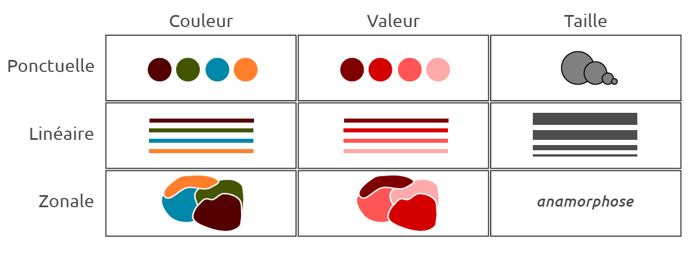
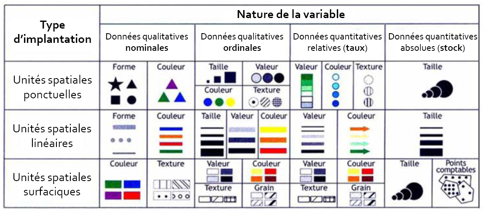
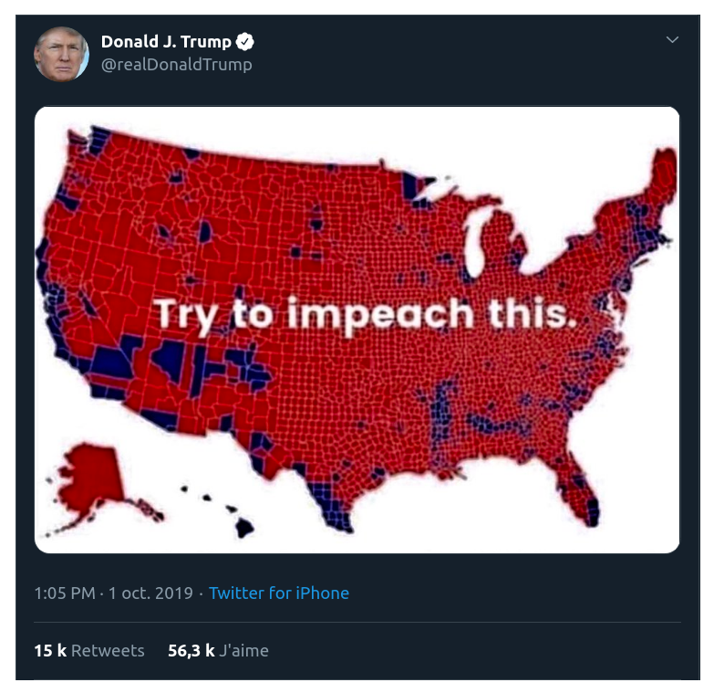
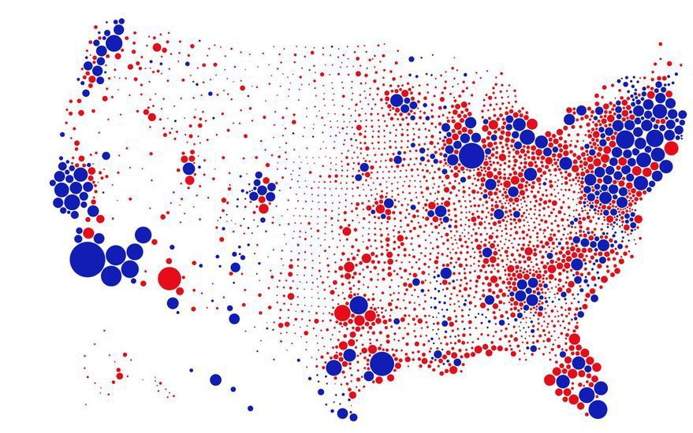
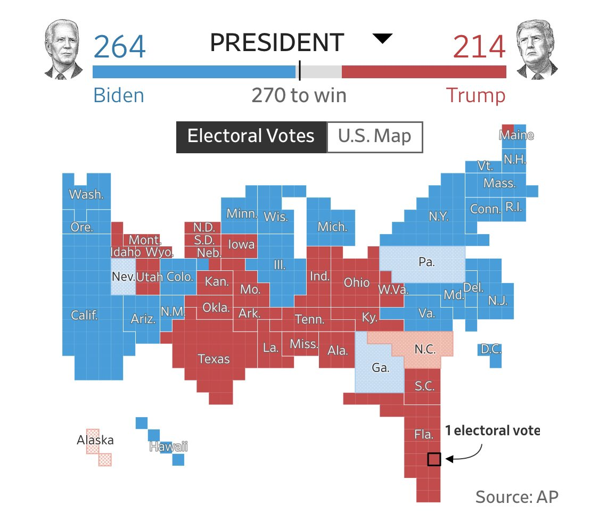
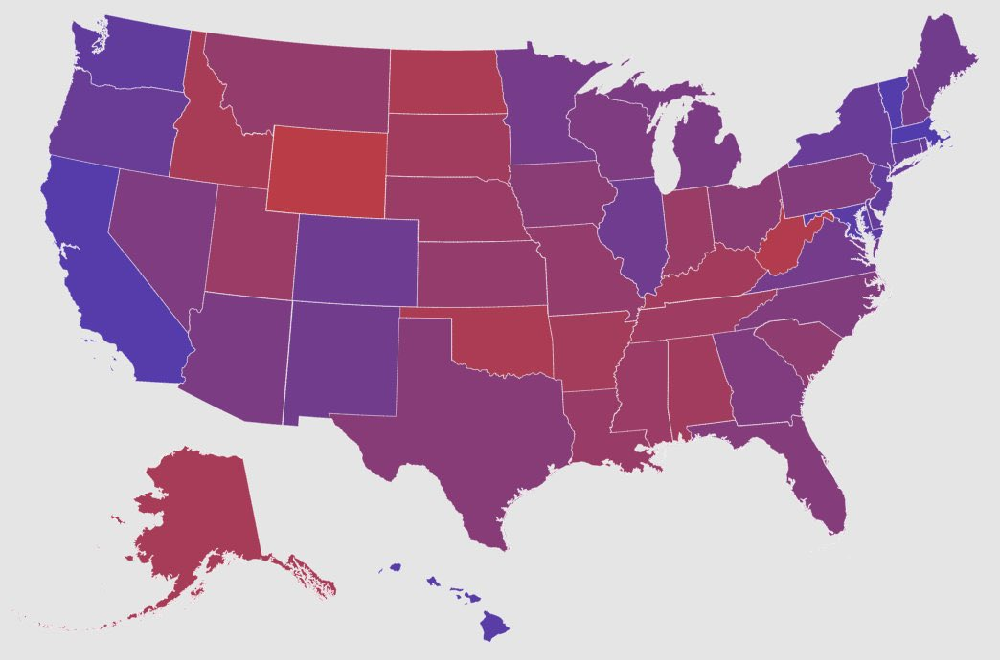
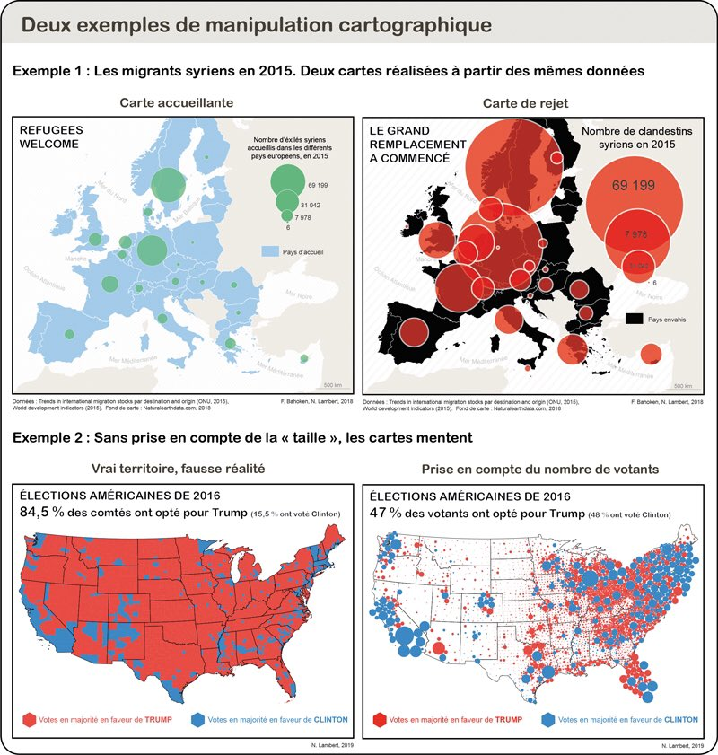

class: inverse, center, middle
# Rappel

```{r setup, include=FALSE}

setwd("C:/Users/Julien M/Dropbox/ENS/Cours/FormationR/statsmappingwithR/statsmappingwithR")
# options(htmltools.dir.version = FALSE)
# knitr::opts_chunk$set(fig.retina=2)
#knitr::opts_chunk$set(cache = F)
# 

# library(Cairo)
# library(cairoDevice)
# load("my_work_space.RData")
library(tidyverse)
library(knitr)
library(kableExtra)
library(sf)
library(spData)
library(mapview)
library(tmap)
library(cartography)
library(viridis)
library(raster)

idf_sf <- st_read(dsn = "02_SpatialData/data/parispc_com.shp", 
                  crs = 2154, 
                  stringsAsFactors = F)
soc_eco <- read.csv("02_SpatialData/data/paris_soc_eco.csv")


soc_eco$INSEE_COM <- as.character(soc_eco$CODGEO)

idf_sf <- left_join(idf_sf, #objet 1 : l'objet sf
                    soc_eco, #objet 2 : le data.frame
                    by = "INSEE_COM") # l'identifiant commun

movies_paris <- st_read(dsn = "03_DataWrangling/data/lieux-de-tournage-a-paris/lieux-de-tournage-a-paris.shp", 
                        crs = 4326, 
                        stringsAsFactors = F)


options(tidyverse.quiet = TRUE)
```


<style>
.html-widget {
    margin: auto;
}
</style>

```{css, echo=FALSE}
/* custom.css */
.left-code {
  color: #777;
  width: 38%;
  height: 92%;
  float: left;
}
.right-plot {
  width: 60%;
  float: right;
  padding-left: 1%;
}
.plot-callout {
  height: 225px;
  width: 450px;
  bottom: 5%;
  right: 5%;
  position: absolute;
  padding: 0px;
  z-index: 100;
}
.plot-callout img {
  width: 100%;
  border: 4px solid #23373B;
}
```

---
# Rappel

- Pour ouvrir des données spatiales sous R, on utilise le package sf ;

- Le format *sf* stocke les formes géométriques et les données attributaires associées dans un même objet. Les variables et individus sont donc stockées dans un *data.frame*.

- Pour manipuler cet objet, on peut utiliser les verbes du *tidyverse* (select, filter, mutate, group_by, *etc*).

- Nous pouvons maintenant basculer vers la cartographie de ces données : R propose des packages dédiés.

---
## Cartographier avec R, mais surtout cartographier...

- La composante technique est importante, mais pas essentielle. 

- Visualiser des données spatiales pour explorer un jeu de données ≠ Cartographier. 
<!-- l'essentiel : la cartographie est une démarche scientifique qui repose sur des normes et méthodes précises.
Visualiser de manière brute des données spatiales relève seulement d'une démarche exploratoire pour se familiariser avec la structure et le contenu d'un jeu de données (repérer les types de variables, les éventuelles valeurs manquantes, identifier des possibilités de traitement, des opérations de recodage à effectuer). -->

- Cartographie : normes de sémiologie graphique ; discours scientifique. 

- Sur la cartographie, deux références : 

  - [Manuel de cartographie](https://www.armand-colin.com/manuel-de-cartographie-principes-methodes-applications-9782200612856) ;
  - Béguin & Pumain, 2003, *La représentation des données cartographiques. Statistiques et cartograhie*, Belin. Chapitres 3 et 5. 


- Pour cartographier avec R, des ressources en ligne :

  - [Cartographie avec R](https://rcarto.github.io/carto_avec_r/) avec le package *cartography* ; 
  - le blog [RGeomatic](https://rgeomatic.hypotheses.org/), du même package, très complet ; 
  - [Chapter 8 Making maps with R](https://geocompr.robinlovelace.net/adv-map.html), en anglais, avec le package *tmap.*  
  - le package *ggplot2*, de la suite *tidyverse* est le plus populaire pour la visualisation de données. il permet de cartographier des objets SF. Voir par exemple ce [manuel en ligne](https://cengel.github.io/R-spatial/mapping.html).
  


---
class: inverse, center, middle

# La sémiologie graphique

---
## Sémiologie graphique

La cartographie utilise un langage cartographique. 

Celui-ci utilise des **variables visuelles** que l'on applique aux formes géométriques (points, lignes, polygones).

Jacques Bertin propose 6 variables (*La sémiologie graphique*, 1967) : la taille, la valeur (ou la teinte) , la couleur, la forme, l'orientation et le grain. <!-- Comme le rappellent Lambert et Zanin, c'était à l'époque du Noir et Blanc.  -->

<!-- De manière pragmatique, 3 variables visuelles sont à retenir : couleur, taille et forme.  -->

L'utilisation de ces variables visuelles, soit la sémiologie graphique, varie selon la nature des données et le type de variables.


---
## Sémiologie graphique : 3 variables

```{r, echo = F, fig.align="center", out.width="100%"}

```
.center[Source : Hadrien Commenges, 2018, "Sémiologie graphique et travail de l’image", Université Paris I]

---
## Sémiologie graphique : variables visuelles

```{r, echo = F, fig.align="center", out.width="90%"}

```
.center[Source : Olivier Finance, 2015, "Sémiologie, Statistique et Cartographie", UPEM]


Dans R, les fonctions des *packages* comportent des arguments pour choisir, tester et modifier ces variables visuelles, de manière quasi-automatique.

En amont, la réflexion scientifique et méthodologique est nécessaire et primordiale. Des connaissances en statistiques descriptives sont donc requises et seront l'objet prochaine séance, notamment sur l'enjeu et les méthodes de discrétisation. 


---
class: inverse, center, middle
# Cartographier : produire un message. 

---
### Cartographier : produire un message. 

```{r, eval = T, echo = F, fig.align="center", out.width="70%", out.height= "80%"}

```
.center[ Source : N. Lambert, [Make our Cartography Great Again!](https://neocarto.hypotheses.org/6569)] 

---
### Cartographier : produire un message. 

```{r, eval = T, echo = F, fig.align="center", out.width="70%"}

```


---
### Cartographier : produire un message. 

```{r, eval = T, echo = F, fig.align="center", out.width="70%"}

```

---
### Cartographier : produire un message. 

```{r, eval = T, echo = F, fig.align="center", out.width="70%"}

```


---
### Cartographier : manipuler ?  

```{r, eval = T, echo = F,fig.align="center", out.width="70%", out.height="70%"}

```


---
## Cartographier : produire un message. 

Des références sur la cartographie : 

- [How Charts Lie: Getting Smarter About Visual Information](http://www.thefunctionalart.com/p/reviews.html), d'Alberto Cairo (University of Miami) ; 
- [Le Carnet (neo)cartographique](https://neocarto.hypotheses.org/), animé par Nicolas Lambert (UMS RIATE).


---
# Exercice : commentaire critique de cartes

Pour chaque carte suivante (postée sur Slack) :  

- Retrouvez le tableau élémentaire : 
  - identifiez la (les) population(s) observée(s) ;
  - Décrivez le type de variable ;
- Commentez et critiquez la composition de la carte (titre, type de variables visuelles choisies). 


---
class: inverse, center, middle

# La couleur

---

### Les couleurs dans R

Une couleur peut s'appeler par son nom (en général en anglais, ex : "*blue*") ou par son code HEX ("#0000FF")

L'argument utilisé est *col*, pour *color*. On peut désigner les couleurs souhaitées, en les nommant par une chaine de charactères (un nom ou un [HEX code](https://htmlcolorcodes.com/fr/)).


.pull-left[

```{r}
plot(st_geometry(idf_sf))
```


]

.pull-right[
```{r}
plot(st_geometry(idf_sf),
col = "khaki4")  #argument
```
]

---
### Les couleurs dans R

R contient [657](http://www.stat.columbia.edu/~tzheng/files/Rcolor.pdf) couleurs. 

```{r, echo = F, fig.align="center"}
par(mfrow = c(2, 2))
plot(st_geometry(idf_sf),
col = "slateblue2", main = "slateblue2") 
plot(st_geometry(idf_sf),
col = "darkgoldenrod", main = "darkgoldenrod") #argument
plot(st_geometry(idf_sf),
col = "hotpink1", main = "hotpink1") #argument
plot(st_geometry(idf_sf),
col = "tomato", main = "tomato") #argument
```

---
### Les packages de couleur

Manipuler des couleurs sous R, c'est manipuler des vecteurs !
```{r, eval = F}
col = "blue"
col = c("blue", "red") # deux couleurs
col = c("0000FF") #Hex code
```

De **très nombreux packages** permettent de choisir des palettes de couleurs : 
- les *packages* de cartographie et *data viz* ont quelques palettes en stock : 
- d'autres *packages* sont spécifiquement développés pour la couleur ; 

Le principe reste le même : nommer la palette désirée avec un argument ; préciser le nombre de couleurs souhaité dans un autre argument (souvent *n = X*). 

---
### Les packages de couleur

Pour la cartographie : 

- le package [RColorBrewer](https://colorbrewer2.org/#type=sequential&scheme=BuGn&n=3) propose des palettes de type continue (gradient de couleur), divergente (gradient divergent, de type chaud-froid) ou qualitative (une couleur par modalité de la variable).

```{r, fig.align= "center", out.height="10%"}
library(RColorBrewer)
display.brewer.all() #affiche toutes les palettes
# display.brewer.pal(n = 8, name = 'Dark2') 
# display.brewer.pal(n = 8, name = 'Oranges')
# display.brewer.pal(n = 8, name = 'Spectral')
```

---
### Les packages de couleur 


- le package *rcartocolor* proposé par l'entreprise [CARTO](https://carto.com/carto-colors/) : 

```{r, fig.align="center"}
library(rcartocolor)
display_carto_all()
```


---
### Les packages de couleur 

- le package [viridis](https://cran.r-project.org/web/packages/viridis/vignettes/intro-to-viridis.html), utilisé par défaut par le package *mapview.*

```{r, fig.align="center" , out.width= "80%", out.height= "30%"}
mapview(idf_sf, zcol = "RFUCQ207")
```

- le *package* [wesanderson](https://www.datanovia.com/en/blog/top-r-color-palettes-to-know-for-great-data-visualization) propose des palettes d'après les films du réalisateur Wes Anderson. 

```{r, echo=F, warning=F}
par(mfrow = c(1, 2))
library(wesanderson)
```

.pull-left[
```{r, fig.align="center", warning=F, out.width="30%"}
wes_palette("Darjeeling1")
```
]

.pull-right[
```{r, fig.align="center", warning=F, out.width="30%"}
wes_palette("GrandBudapest2")
```
]


---
### Les couleurs dans R


**Bilan technique** - Appeler une palette de couleur consiste à appeler un *vecteur* composé de chaines de caractères, qui renvoient à des codes couleurs.  

```{r, eval = F}
col = viridis(2) #vecteur de taille 2
```

```{r, eval = T}
viridis(2) # éléments du vecteur
```
Cette [page internet](https://github.com/EmilHvitfeldt/r-color-palettes) recense toutes les palettes et packages développés pour la couleur. 

**Bilan scientifique** - le choix des couleurs est dicté par : 

- le type de variable (quanti / quali) ; 
- le message de la carte (couleur = charge symolique, connotation culturelle) ; 
- les qualités esthétiques (une carte doit être agréable à regarder ; distinction fond de carte / données à cartographier). 


---
## Sémiologie : un choix esthétique et scientifique. 

Selon que la variable soit **quantitative** (stock / ratio) ou **qualitative** (nominal / ordinal), différentes normes s'imposent. 

Dans R, l'exploration des données a donc pour enjeu d'identifier le type de variables.

*Rappel : glimpse(), summary(), table(), plot(), mapview()*.


---
## Composition et habillage

Une carte comporte **obligatoirement** : 

- un titre clair et court, intégré au graphique ; 
- une légende hiérarchisée et équilibrée d'un point de vue graphique ; 
- une échelle ;
- des sources : nom de l'auteur et origine des données (institution, date).

Sous R, l'ensemble de ces éléments est paramétré par les *arguments* de chaque *fonction.*


---
class: inverse, center, middle

# Le package *cartography*


---
## La carte typologique : production, habillage et sauvegarde

Elle permet de représenter une variable qualitative. 


```{r, eval = F}
library(cartography)

# Fonction typoLayer
typoLayer(objet_sf,
            var = "Variable", #variable à cartographier
           ... #autres arguments séparés par une virgule,
) # parenthèse pour fermer la fonction !

# Habillage avec layoutLayer
layoutLayer(title = "texte", #titre de la carte
              author = "texte", #auteur
              sources = "texte") #source et données
```


---
### Fonction de base


.left-code[
```{r plot-label0, eval=FALSE}
typoLayer(idf_sf,
  var = "NOM_DEPT"
  ) 
```
]

.right-plot[
```{r plot-label0-out, ref.label="plot-label0", echo=FALSE}
```
]

---
### Choix d'une palette de couleur

.left-code[
```{r plot-labelA, eval=FALSE}
typoLayer(idf_sf,
  var = "NOM_DEPT", 
  col = viridis(4)
  ) 
```
]

.right-plot[
```{r plot-labelA-out, ref.label="plot-labelA", echo=FALSE}
```
]


---
### Légende

.left-code[
```{r plot-label, eval=FALSE}
typoLayer(idf_sf,
var = "NOM_DEPT", 
col = viridis(4),
legend.title.txt = "Département", 
legend.pos = "topleft"
  ) 
```
]

.right-plot[
```{r plot-label-out, ref.label="plot-label", echo=FALSE}
```
]


---
### Habillage

.left-code[
```{r plot-label1, eval=FALSE}
typoLayer(idf_sf,
var = "NOM_DEPT", 
col = viridis(4), 
legend.title.txt = "Département", 
legend.pos = "topleft"
) 

layoutLayer(
title = "L'Ile de France", 
author = "J. Migozzi, 2020.", 
sources = "Insee, 2007"
)
```
]

.right-plot[
```{r plot-label1-out, ref.label="plot-label1", echo=FALSE}
```
]

---
### Export et sauvegarde

On peut exporter les graphiques au format PDF, JPG, PNG...

- Soit on clique sur "Export" et on sauvegarde  à la main..

--

- Soit on code avec les fonctions pdf() ou png(). Intérêt : reproductible. Voir des explications [ici](https://www.datamentor.io/r-programming/saving-plot/) ou [là](http://larmarange.github.io/analyse-R/export-de-graphiques.html).

---
### Export et sauvegarde


```{r, eval = F}
# 1. D'abord, on place en haut la fonction pour sauvegarder

pdf("img/Carte.pdf", # Emplacement et nom du fichier
width=7, #largeur en pouces
height=7 , #hauteur en oouces
useDingbats=FALSE)

# Ou bien 
png("img/Carte.png")# Emplacement et nom du fichier

#2. Puis on place TOUTES les lignes de code pour produire la carte

typoLayer(....)
layoutLayer(...)

#3. On conclut avec la fonction dev.off() qui 
# "clotûre" les fonctions pdf() ou png()

dev.off()

# On exécute le tout ! 
```
On récupère aun fichier *.pdf* ou *.png* dans le dossier défini (d'où l'importance du *working directory* !)

---
### Export et sauvegarde

Chaque fois que l'on veut changer un titre, un palette de couleurs, une variable *etc*, il suffit de modifier la ligne de code correspondante, et de tout exécuter. 

Le fichier précédent est automatiquement remplacé par cette nouvelle version. 

On peut ainsi produire, à la chaîne, autant de cartes que nécessaire, en faisant du copier-coller, voire en écrivant des boucles (niveau plus avancé).


---
# La carte de symboles proportionnels


```{r, echo = T, eval = F}

plot(st_geometry(idf_sf), 
     col="ivory",#fond de carte
     border = "ivory3") #bordures

propSymbolsLayer(idf_sf, 
  var = "POPULATION", #nom de la variable 
  legend.pos = "topleft", #position de la légende
  inches = 0.1, #taille du plus gros symbole
  legend.style = "e", #légende "étendue"
  legend.title.txt = "Population en milliers", #titre de la légende
  add = T) #ajouter au fond de carte

layoutLayer(title = "Population en Ile de France", 
    author = "Auteur: J. Migozzi",
    sources = "Source : R et Espace, 2018",
    tabtitle = T,
    frame = TRUE, 
    scale = NULL)
```

---
# La carte de symboles proportionnels

```{r, echo = F, fig.align="center"}

plot(st_geometry(idf_sf), col="ivory", border = "ivory3") #fond de carte

propSymbolsLayer(idf_sf, 
                var = "POPULATION", #nom de la variable 
                legend.pos = "topleft", #position de la légende
                inches = 0.1, #taille du plus gros symbole
                legend.style = "e", 
                legend.title.txt = "Population en milliers", #titre de la légende
                add = T) #ajouter au fond de carte

layoutLayer(title = "Population par commune en Ile de France", 
    author = "Auteur: J. Migozzi",
    sources = "Source : R et Espace, 2018",
    tabtitle = T,
    frame = TRUE, 
    scale = NULL)
```

---
# La carte typologique : figuré ponctuel

Il faut tricher un peu en utilisant la fonction propSymbolsTypoLayer, qui prend deux variables : 
- une variable de stock, pour la taille du figuré ; 
- une variable qualitative, pour la couleur du figuré ; 

Je crée ces deux variables : 

```{r, echo = T}
bdl <- movies_paris %>% 
  filter(str_detect(nom_tournag, "BUREAU")) %>%
  mutate(Tournage = "Bureau des légendes") %>%
st_transform(2154) %>% 
  mutate(Map = 1) #Nouvelle variable quanti
```

---
## La carte typologique : figuré ponctuel

```{r, eval = F}
plot(st_geometry(idf_sf %>% filter(NOM_DEPT == "PARIS")),
     col="white", #couleur fond de carte 
     border="darkseagreen4", #coueur bordure 
     bg = "white", #couleur du fond
     lwd = 2) #largeur bordure

propSymbolsTypoLayer(bdl,
                     var = "Map",
                     var2 = "Tournage",
                     inches = 0.05,
                      col = viridis(1), 
                     legend.var.pos = "none",  
                     add = T
                     )
layoutLayer("Le Paris des espions")

```

---
## La carte typologique : figuré ponctuel

```{r, eval = T, echo = F, fig.align= "center", out.height="100%"}
plot(st_geometry(idf_sf %>% filter(NOM_DEPT == "PARIS")),
     col="azure3", #couleur fond de carte 
     border="white", #couleur bordure 
     bg = "white", #couleur du fond
     lwd = 2) #largeur bordure

propSymbolsTypoLayer(bdl,
                     var = "Map",
                     var2 = "Tournage",
                     inches = 0.06,
                      col = viridis(2)[2], 
                     legend.var.pos = "none",  
                     add = T
                     )
layoutLayer("Le Paris des espions")
```


---
# Le fond de carte

Travailler dans R permet d'appeler des fichiers raster pour obtenir des fonds de carte auprès de divers fournisseurs : OpenStreetMap, CartoDB, Esri etc. 

Il peut s'agir de cartes, de photographies aériennes, dont on choisit la résolution (la finesse). 

---
# Le fond de carte

Le package *cartography* propose une [fonction](https://www.rdocumentation.org/packages/cartography/versions/2.4.2/topics/getTiles) pour cela. 
```{r, echo = T, warning=F}
paris <- idf_sf %>% filter(NOM_DEPT == "PARIS")
#Télécharger un fond de carte avec la fonction getTiles
parisOSM <- getTiles(x = paris,
                   type = "CartoDB.Positron", 
                   crop = TRUE)
```
---
# Le fond de carte

```{r, echo = T, warning=F, fig.align="center"}
tilesLayer(parisOSM)
```

---
# Le fond de carte

```{r, eval = F, echo = T, warning=F}
library(raster)
parisOSM <- mask(parisOSM, paris) #clipper le raster

tilesLayer(parisOSM)
                     
plot(st_geometry(idf_sf %>% filter(NOM_DEPT == "PARIS")),
     col=NA, #couleur fond de carte 
     border="grey80", #couleur bordure 
     bg = "white", #couleur du fond
     lwd = 2, 
     add = T)

propSymbolsTypoLayer(bdl,
                     var = "Map",
                     var2 = "Tournage",
                     inches = 0.06,
                      col = viridis(2)[2], 
                     legend.var.pos = "none",  
                     add = T)
                     

layoutLayer("Le Paris des espions")

```


---
# Le fond de carte

```{r, echo = F, eval = T, fig.align="center", warning=F}

parisOSM <- mask(parisOSM, paris) #clipper le raster
tilesLayer(parisOSM)
                     
plot(st_geometry(idf_sf %>% filter(NOM_DEPT == "PARIS")),
     col=NA, #couleur fond de carte 
     border="grey80", #couleur bordure 
     bg = "white", #couleur du fond
     lwd = 2, 
     add = T)

propSymbolsTypoLayer(bdl,
                     var = "Map",
                     var2 = "Tournage",
                     inches = 0.06,
                      col = viridis(2)[2], 
                     legend.var.pos = "none",  
                     add = T
                     )

layoutLayer("Le Paris des espions")

```

---
# Exercice 

Sur un même script, réalisez les exercices suivants.

A partir des données proposées par la municipalité de Paris, proposez trois cartes : 
- le nombre de tournages par arrondissement en 2017 ; 
- le nombre de tournages par arrondissement en 2018 ; 
- une même carte qui montre les localisations de la saison 8 d'Engrenages ET la série Emily in Paris. 

NB : pour la dernière carte, vous devrez recoder vos variales pour créer une nouvelle variable "Tournage". Celle-ci aura deux modalités : "Engrenages" ou "Emily in Paris". Vous devrez donc utiliser la fonction *mutate*, en l'associant aux fonctions *if_else* ou *case_when*, en vous aidant des ressources en ligne (par exemple ce tutoriel [ici](http://larmarange.github.io/analyse-R/recodage.html#combiner-plusieurs-variables-1)). 

---
# Exercice : suite

A partir des données sur les élections américaines de 2020, proposez trois cartes : 
- une carte typologique qui montre le vainqueur dans chaque état ; 
- une carte montrant le nombre de votes obtenus par Biden dans chaque état ; 
- une carte montrant le nombre de votes obtenus par Trump dans chaque état ; 

NB : Vous devrez donc créer une variable qualitative (pour le vainqueur) à partir de deux variables quantitatives en stock (Trump et Biden), en utilisation de nouveau les fonctions *mutate* et *if_else*.


Postez votre script (NOM_Prenom.R) et vos 6 cartes sur Slack **avant dimanche soir**. 


---

class: center, middle

# Fin

Slides crées avec le package [**xaringan**](https://github.com/yihui/xaringan).

