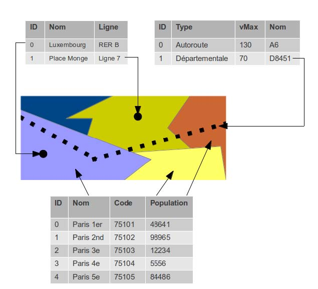
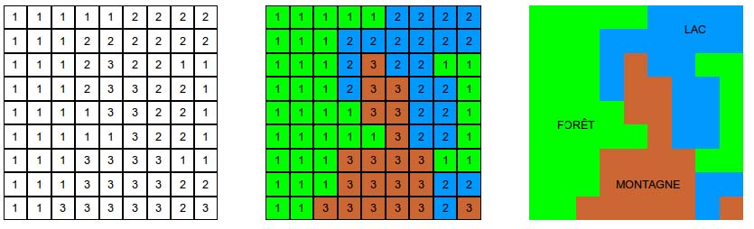
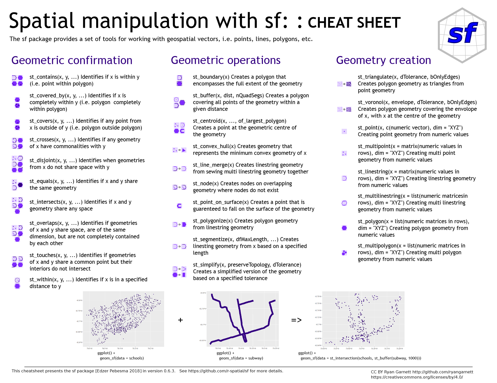
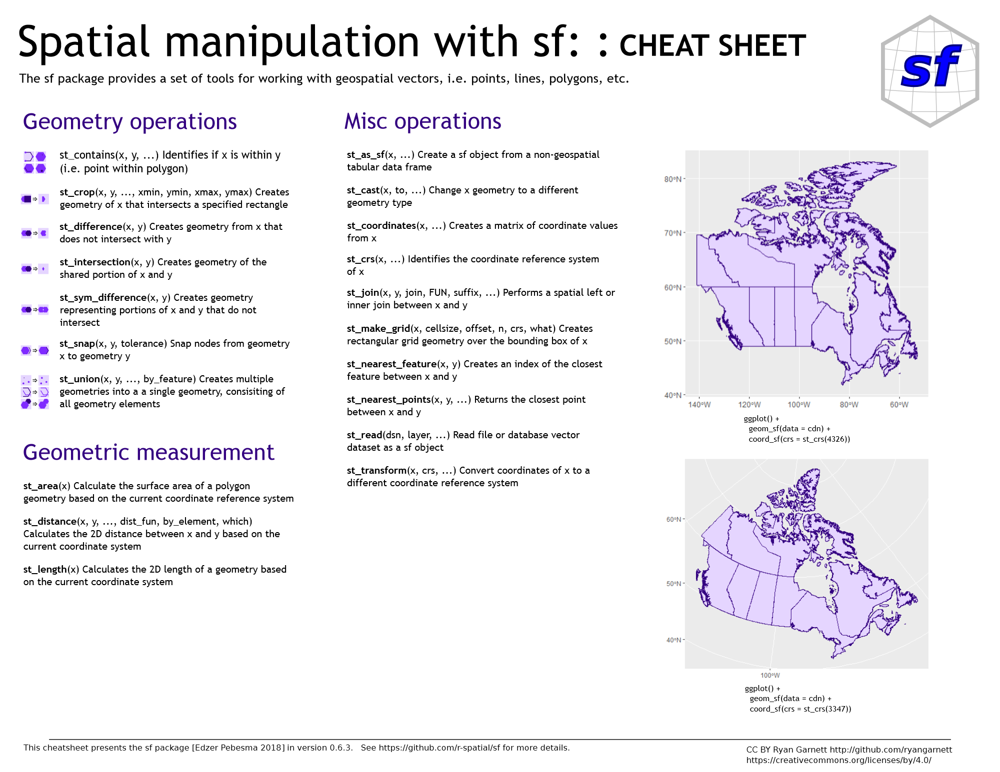

class: inverse, center, middle
# L'information géographique


```{r setup, include=FALSE}
# options(htmltools.dir.version = FALSE)
# knitr::opts_chunk$set(fig.retina=2)
#knitr::opts_chunk$set(cache = F)
# 
# library(Cairo)
# library(cairoDevice)
# load("my_work_space.RData")
library(tidyverse)
library(knitr)
library(kableExtra)
library(sf)
# library(spData)
options(tidyverse.quiet = TRUE)
```


<style>
.html-widget {
    margin: auto;
}
</style>

---
## L'information géographique

<blockquote>
Une information est dite géographique lorsqu'elle se rapporte à un ou plusieurs lieux de la surface terrestre. C'est une information localisée et repérée, ou encore "géocodée"
.right[-- <cite>Béguin & Pumain, 2010</cite>]
</blockquote>

Deux grands types de données : 
  - données dites géométriques : information spatiale (des _formes_)
  - données non géométriques, que l'on doit relier aux autres (par exemple, un tableau INSEE)
  
---
## Vecteurs et Rasters

On distingue deux types de données géométriques : 

- les données vectorielles : les **vecteurs** ; 
- les donnéées matricielles : les **rasters**.

---
### Les vecteurs

Ce sont des représentations géomatriques d'une entité géographique


```{r, echo = F, fig.align="center", out.width="60%"}

include_graphics("img/points-lines-polygons-vector-data-types.png")

```

.center[[Source : Earth Lab](https://www.earthdatascience.org/courses/earth-analytics/spatial-data-r/intro-vector-data-r)]

---
### Les vecteurs

Ces données se présentent sous forme de tableaux : 
  - chaque géométrie constitue une ligne : une entité ou un individu ; 
  - chaque attribut est une colonne : un champ ou une variable

```{r, echo = F, fig.align="center", out.width="50%"}


```

.center[On retrouve notre tableau élémentaire !]

---
### Les rasters

Ce sont des objets matriciels, composés de cellules, dont la taille définit la résolution. 

On divise le monde en cellules : chaque phénomène est enregistrée et mesurée dans chaque cellule. 

Ce sont des images géoréférencées. 


```{r, echo = F, fig.align="center", out.width="80%"}


```

---
### Les rasters

Beaucoup de rasters sont à disposition : 
- des images satellites ; 
- des orthophotos, comme celle de l'[IGN](https://geoservices.ign.fr/blog/2020/09/08/Grand_angle_diffusion_ortho.html) ; 
- des cartes d'occupation des sols,  par exemple pour l' [UE](https://www.statistiques.developpement-durable.gouv.fr/corine-land-cover-0) ou les [Etats-Unis](https://www.mrlc.gov/) ; 

Exemple : [Google Earth Engine](https://earthengine.google.com/) et le package [rgee](https://github.com/r-spatial/rgee) :
- température 
- précipitation, surface en eaux ; 
- données atmosphériques
- modèles d'élévation de terrain
- *etc.*

---
## Les données non-géométriques

Ce sont des tableaux qui ne comportent pas d'information spatiale, qu'il s'agit donc de retrouver en utilisant une des variables disponibles : 
- un code postal ; 
- un nom de commune, de pays *etc*; 
- une adresse postale ; 
- des coordonnées XY ; 

Il faut donc réaliser une **jointure** entre le tableau et des données géométriques !

---
## Les coordonnées géographiques ou *Coordinate Reference System*

- La terre est ronde. On la modélise comme une sphère, soit un objet en 3 dimensions, pour créer un système géodésique qui sert de cadre de réference pour exprimer une localisation selon des coordonnées.

--

- On utilise deux valeurs pour localiser un point à partir d'une sphère : 
  - la **longitude** positionne d'est en ouest ; 
  - la **latitude** positionne du nord au Sud. 
  - Longitude et latitude sont les coordonnées géographiques d'un point.
  - Attention : les distances ne sont pas mesurées en mètre !
  
--

- Une carte est un objet en deux dimensions. Il faut donc passer d'une sphère à une surface plane. 
  - On utilise une **projection**, c'est à dire une transition mathématique (voir cette [vidéo](https://www.youtube.com/watch?v=OUQe2a0FOnc&list=PL6-_uJ2qn-8knSkvNkxs5BJbJy5PgtchL&index=2)).
  - On projete donc la sphère, ou une portion, sur une surface plane, ce qui introduit une déformation des angles, des longueurs, des formes et des surfaces.

---
## Les coordonnées géographiques ou *Coordinate Reference System*

- Le choix d'un SRC ou *CRS* répond donc à une question de recherche, à un enjeu de visualisation : quel territoire est étudié/cartographié ? 

- Il faut donc choisir un système approprié lorque : 
  - on crée des données spatiales ; 
  - on en récupère.

--

- Chaque système est réferencé par un identifiant au sein d'un [large catalogue](https://spatialreference.org/ref/epsg/):

  - France : projection Lambert - RGF93 : EPSG:2154
  - Monde : WGS84 (utilissé par système gps) : EPSG:4326
  - Google Mercator : EPSG:3857

--

- Le choix d'un CRS adapté est essentiel pour calculer des distances, donc des densités ou des surfaces.

---
## Les formats des données spatiales

- Pour les vecteurs, on trouve souvent le format **shapefile** : 
  - développé par l'entreprise ESRI ; 
  - constitué au minimum des 3 fichiers suivants :  
  
      - *.shp* : contient les formes géométriques (points, lignes, polygones) ; 
      - *.shx* : stocke l'index de la géométrie
      - *.dbf* : contient les données attributaires (individus en ligne, variable en colonne)

- Mais on utilise aussi des formats KML, GeoJSON...

- Un format en vogue est le **GeoPackage** : 
    - format libre ; 
    - vecteurs et rasters.
  
  
---
class: inverse, center, middle

# Le package SF : Simple Features

```{r, echo = F, fig.align="center", out.width="80%"}

include_graphics("img/Sf_Horst.jpg")
```
.center[[Source : Allison Horst](https://github.com/allisonhorst/stats-illustrations)]

---

## Le format SF : Simple Features

- R dispose de packages qui permettent de lire, manipuler et visualiser des données spatiales.

- Le package `sf` s'impose comme le format de réference. 

- Il rend compatible les objets spatiaux avec la syntaxe du format `tydiverse`, qui permet de manipuler des tableaux.

- La [documentation en ligne](https://cran.r-project.org/web/packages/sf/index.html) est très fournie. De nombreux [tutoriels](https://github.com/riatelab/intro_sf) sont disponibles sur internet en français et anglais. 

- Avant de s'intéresser à SF, il nous faut comprendre l'intégration entre RStudio, les données, le script et les packages.
---

## Lire un fichier spatial

- Avec le package SF, on utilise la fonction `st_read()`

- Celle-ci doit spécifier : 
  - le chemin pour trouver le fichier ; 
  - le nom du fichier et son format ; 
  - la projection utilisée (code epsg) ;
  - *stringsAsFactors = F*, pour éviter de transformer les variables textuelles en facteurs ; 


```{r, echo = T, eval=T}
idf_sf <- st_read(dsn = "data/parispc_com.shp", 
                  crs = 2154, 
                  stringsAsFactors = F)
```

---

## Explorer un objet spatial

- La console indique déjà quelques informations 
```{r, echo = T, eval=T, include = T}
idf_sf <- st_read(dsn = "data/parispc_com.shp", 
                  crs = 2154, 
                  stringsAsFactors = F)
```

---
## Explorer un objet spatial

On peut utiliser les fonctions de  base pour se renseigner sur un objet: 
```{r, echo = T, eval = T}
colnames(idf_sf)
class(idf_sf)
head(idf_sf)
```

---
## Explorer un objet spatial

- Sélectionnner l'objet dans l'environnement de travail : 

Environnement -> Data -> idf_sf

- Repérer le type de variables :

```{r, echo = F}
knitr::kable(head(idf_sf), format = 'html')%>%
  kable_styling(bootstrap_options = "striped", font_size = 7)
```

---

## Explorer un objet spatial 

```{r, echo = T, eval=T, fig.align="center"}
plot(idf_sf)
```
---

## Explorer un objet spatial 

```{r, echo = T, eval=T, fig.align="center"}
plot(idf_sf["NOM_DEPT"]) #choisir une colonne
```

---
## Explorer un objet spatial avec le package _mapview_

```{r, echo = T, eval=T, fig.align="center"}
library(mapview) # charger un package
mapview(idf_sf) # fonction mapview
```

---

## Explorer un objet spatial avec le package _mapview_

L'argument _zcol_ permet de visualiser une variable

```{r, echo = T, eval=T, fig.align="center"}
mapview(idf_sf, zcol = "CODE_DEPT") 
```

---
# Manipuler des géométries


```{r, echo = F, fig.align="center", out.width="100%"}


```
---

```{r, echo = F, fig.align="center", out.width="100%"}


```


---
# Bilan 

Le package SF joint dans un même objet : 

- des données attributaire : variables en colonnes et individus en ligne ; 
- des données géométriques : des formes et leurs coordonnées ; 


Cet objet SF peut donc être manipulé dans un but de : 
  - cartographie ; 
  - analyse statistique ; 
  - analyse spatiale.
  
---
class: center, middle

# Merci !

Slides crées avec le package [**xaringan**](https://github.com/yihui/xaringan).

