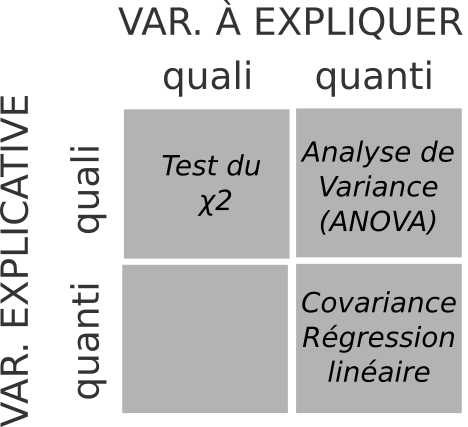
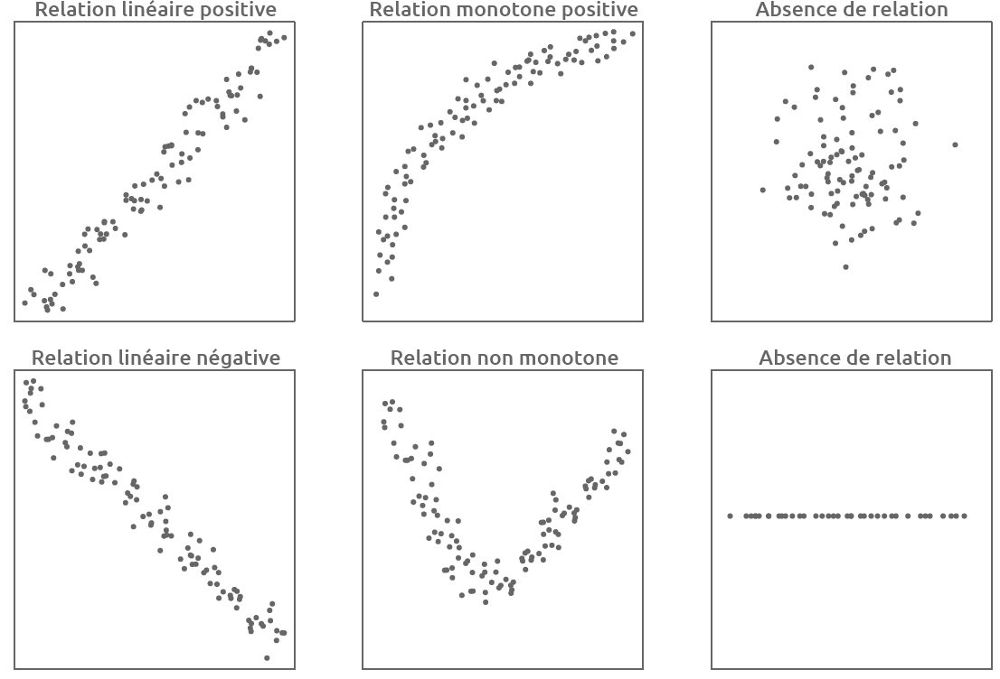
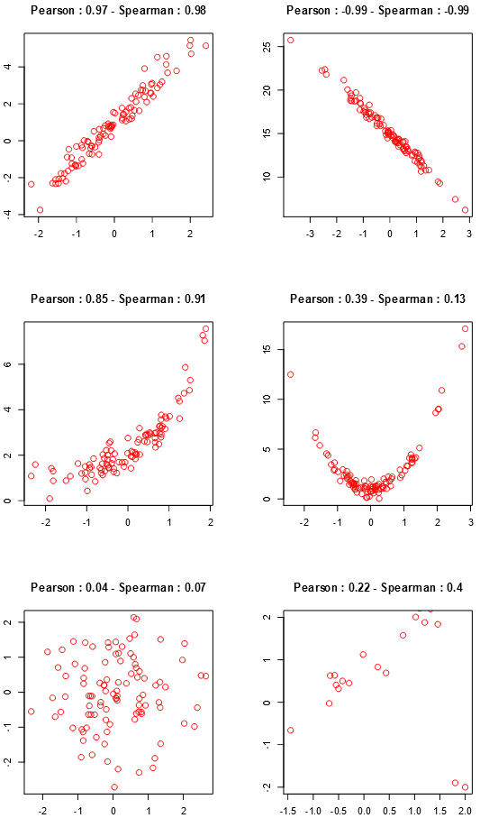

class: inverse, center, middle

# Rappel


```{r setup, include=FALSE}

setwd("C:/Users/jmigozzi/Dropbox/ENS/Cours/FormationR/statsmappingwithR/statsmappingwithR")
# options(htmltools.dir.version = FALSE)
# knitr::opts_chunk$set(fig.retina=2)
#knitr::opts_chunk$set(cache = F)
# 

# library(Cairo)
# library(cairoDevice)
# load("my_work_space.RData")
library(tidyverse)
library(knitr)
library(kableExtra)
library(sf)
library(spData)
library(mapview)
library(tmap)
library(cartography)
library(viridis)
library(raster)
library(ggthemes)
library(hrbrthemes)

idf_sf <- st_read(dsn = "02_SpatialData/data/parispc_com.shp", 
                  crs = 2154, 
                  stringsAsFactors = F)
soc_eco <- read.csv("02_SpatialData/data/paris_soc_eco.csv")


soc_eco$INSEE_COM <- as.character(soc_eco$CODGEO)

idf_sf <- left_join(idf_sf, #objet 1 : l'objet sf
                    soc_eco, #objet 2 : le data.frame
                    by = "INSEE_COM") # l'identifiant commun

movies_paris <- st_read(dsn = "03_DataWrangling/data/lieux-de-tournage-a-paris/lieux-de-tournage-a-paris.shp", 
                        crs = 4326, 
                        stringsAsFactors = F)


options(tidyverse.quiet = TRUE)
```


---
## De la statistique descriptive à la cartographie 

- Ouvrir, explorer et manipuler des données spatiales sous R ; 

<br>

- Décrire une distribution statistique : 
  - pour une variable *catégorielle* : 
      - regarder la **fréquence** avec un tableau de dénombrement ; 
      - **visualiser** (diagramme en bâton).
  - pour une variable *quantitative*, regarder : 
      - les mesures de **position** (moyenne, mediane) et de **dispersion** (variance, écart-type); 
      - **visualiser** la distribution (histogramme, *boxplot*).
      - discrétiser.

<br>
  
- Adopter les variables visuelles appropriées (*forme, taille, couleur*) ; 

<br>

- Soigner l'habillage de la carte (*titre, légende, source, auteur, date*). 

---
class: middle, center, inverse

# De l'univarié à l'analyse bivariée

## Vers la modélisation

---
### Statistiques bivariée

- Analyse et à représentation d'une variable : **statistique univariée**. 

- Indicateurs et visualisation : charpente de la statistique & prélude indispensable à toute cartographie de données.

<br>
--
<br>

- Statistique **bivariée** : étude des *relations* entre deux variables, quelles soient qualitatives ou quantitatives. 

--

- La statistique bivariée consiste à analyser la relation entre deux variables, c'est à dire à mesurer comment ces deux variables *covarient*, à identifier des dépendances. 


---
### Vers la modélisation 

- C'est une première étape vers la modélisation : *expliquer*, voire de *prédire* le réel par le biais d'un modèle mathématique résumant la relation entre deux variables. 


- Cette modélisation mathématique repose sur : 
  - une **variable à expliquer**, dite aussi variable dépendante, *target*, *responsable variable*...
  - une **variable explicative**, dite aussi variable indépendante, *regressor*, *covariate*, *feature*...

--
  
- Expliquer *Y* en fonction de *X* revient à proposer une équation : 

$$y = f(x)$$
---
### Modèle : mesurer une relation statistique


- Il s'agit de confronter des données empiriques (collectées sur le terrain, acquises auprès d'un fournisseur) à des données théoriques, produites par un modèle, puis déterminer l'importance de l'**écart** entre données empiriques et théoriques.

- Plus l'écart entre données et modèle est petit, plus la relation entre les deux variables est forte, *sans que l'on puisse parler de causalité*. On quantifie seulement l'intensité de la relation. 


---
### Variables, relations et choix du modèle

Le modèle à employer pour étudier une relation dépend du type de variables.

<br>

```{r, fig.align="center", echo = F, out.width="40%"}

```
.center[ .tiny[Graphique inspiré de [Hadrien Commenges](https://gitlab.huma-num.fr/hcommenges/cours_statcomplet)]]

--


   <br> 
.center[.content-box-red[Choix des variables et du modèle : question scientifique]]
  <br>
  
  
---
class: center, middle, inverse

# Analyser une relation bivariée

## Visualisation, covariance corrélation

---
### Visualisation

On utilise un *scatter plot*, ou nuage de points, pour visualiser la relation entre deux variables quantitatives continues. 

```{r, fig.align="center", out.width="55%"}
plot(idf_sf$POUV07, idf_sf$PCAD07)
```

---
### Visualisation

Le nuage de points permet de déterminer la relation : 

- l'**intensité**  : *forte*, *faible*, *nulle.*
- la **forme**  : *linéaire*, *non-linéaire*.
- le **sens** : *positive*, *négative.* 

<br>

<!-- Selon la forme de la relation observée, on ne fera pas les mêmes hypothèses et on n'utilisera pas les mêmes outils de mesure. -->

```{r, echo = F, out.width= "70%",fig.align="center"}

```
.center[ .tiny[Graphique inspiré de [Hadrien Commenges](https://gitlab.huma-num.fr/hcommenges/cours_statcomplet)]]

---
## Mesurer la relation : covariation et covariance

- On dit qu'il existe une relation entre *X* et *Y* si : 
  - les valeurs de *X* dépendent des valeurs de *Y*  ou 
  - si les valeurs de *Y* dépendent des valeurs de *X.*

<br>
- Deux variables entretiennent une **relation linéaire** entre elles si la variation relative de l'une d'entre elles entraîne une variation relative constante de l'autre .tiny[(O. Martin, 2014)].

<br>

- La **covariance** est une valeur qui permet de connaître dans quelle mesure les variables d'une série statistique évoluent ensemble.

---
## La covariance

.center[La **covariance** est la moyenne du produit des écarts.]


$$cov_{x,y}=\frac{\sum_{i=1}^{N}(x_{i}-\bar{x})(y_{i}-\bar{y})}{N-1}$$

où *N* est l'effectif de la population, $\bar{x}$ la moyenne de *x* et $\bar{y}$ la moyenne de *y*.

--

<br>

**Exercice** : calculez, à l'aide de R, la covariance du taux d'ouvriers en 2007 (x) et 
du taux de cadres en 2007 (y) : 

- calculez les écarts à la moyenne ; 
- calculez le produit des écarts ; 
- calculez la somme du produit des écarts ; 
- calculez la covariance


---
### Solution 

Manuellement, en codant toutes les étapes : 

```{r, echo = T}
xdev <- idf_sf$POUV07 - mean(idf_sf$POUV07) #écart à moyenne
ydev <- idf_sf$PCAD07 - mean(idf_sf$PCAD07)

xdev_ydev <- xdev * ydev #produit

sum_xdev_ydev <- sum(xdev_ydev) #somme produit

cov_xy <- sum_xdev_ydev / (nrow(idf_sf) - 1) # moyenne
cov_xy <- sum_xdev_ydev / (143 - 1) # nrow(idf_sf) = 143

cov_xy
```

---
### Solution 

Avec le *tidyverse* : 

```{r}
idf_sf %>% st_set_geometry(NULL) %>%
  mutate(EcartOuv = POUV07 - mean(POUV07), 
        EcartCad = PCAD07 - mean(PCAD07)) %>%
    mutate(Produit = EcartOuv*EcartCad) %>%
summarise(SommeProduit = sum(Produit)) %>%
summarise(Cov = SommeProduit / (nrow(idf_sf) - 1)) 
```

Avec R et la fonction *cov*() : 
```{r}
cov(idf_sf$POUV07, idf_sf$PCAD07)
```


---
### De la covariance à la corrélation

La covariance n'a pas beaucoup de signification en elle-même puisqu’elle dépend des unités de mesure.  

<!-- - La covariance se calcule avec des écarts à la moyenne : ne dépend donc pas de l’ordre de grandeur de la variable. -->
<!-- - La covariance est une moyenne (somme rapportée à l’effectif) : ne dépend donc pas du nombre d’observations. -->
<!-- - La covariance dépend de la variation (dispersion) des deux variables autour de la moyenne : on neutralise cet effet en la rapportant au produit des écart-types des deux variables.  -->

- On *standardise la covariance* en la rapportant au produit des écarts-types. La formule est la suivante : 

$$R = \frac{\text{cov}(X,Y)}{\sigma_x \sigma_y}$$
où $\sigma_y$ est l'écart type de *y*, soit la racine carré de la variance de *y.*

- *R* est dit coefficient de Bravais-Pearson, coefficient de Pearson, ou encore **coefficient de corrélation**.

---
## Les coefficients de corrélation : Pearson


- Le coefficient de Pearson permet de détecter la présence ou l'absence d'une relation linéaire entre deux caractères quantitatifs continus.

<br>

- Il **varie entre -1 et +1**. 

<br>

- Son interprétation est la suivante :

  - R proche de 0 : pas de relation linéaire entre *X* et *Y*.
  - R tends vers - 1 :  il existe une forte **relation linéaire négative** entre *X* et *Y*.
  - R tends vers 1 : il existe une forte **relation linéaire positive** entre *X* et *Y*.


---
## Les coefficients de corrélation : Spearman

- Ce coefficient de **corrélation de rang** examine s'il existe une relation entre le rang des observations pour deux caractères *X* et *Y*.

<br>

- Il est préférable au coefficient de Pearson lorsque les distributions *X* et *Y* sont dissymétriques et/ou comportent des valeurs exceptionnelles. 

<br>

- Il est fondé sur l'étude de la **différence des rangs** entre les attributs des individus pour les deux caractères *X* et *Y*.

<br>

- Il **varie entre -1 et +1** : même signification que Pearson.

---
## Les coefficients de corrélation 


```{r, echo = F, out.width= "40%", fig.align="center"}

```
.center[.tiny[Source : [Julien Barnier](https://juba.github.io/tidyverse/04-bivarie.html#calcul-dindicateurs)]]

---
## Bilan des coefficients

<br>
<br>

.center[.content-box-blue[Le signe de *R* (+/-) indique le **sens** de la relation]]
<br><br>
.center[.content-box-blue[La valeur absolue de *R*  indique l'**intensité** de la relation]]
<br>

.center[Intensité de la relation :]

.center[capacité à prédire les valeurs de *Y* en fonctions de celles de *X*.]

---
### Corrélation : application sur R

<br>

On utilise la fonction *cor()*. Cette fonction s'applique sur deux variables, en précisant la méthode souhaitée par l'argument *method*.


### Pearson
```{r, eval = F}
cor(data.frame$X, data.frame$Y, 
    method = "pearson")
```

### Spearman

```{r, eval = F}
cor(data.frame$X, data.frame$Y, 
    method = "spearman")
```

---
### Matrice de corrélation

- Pour plusieurs variables !

- Plusieurs packages existent : 
  - [corrplot](https://cran.r-project.org/web/packages/corrplot/vignettes/corrplot-intro.html) ; 
  - [corrr](https://cran.r-project.org/web/packages/corrr/vignettes/using-corrr.html), compatible avec le *tidyverse*, sorti le 24 novembre 2020. 
  
 
---
class: inverse, middle, center

# Visualisation : un détour par *ggplot2*

## La grammaire des graphiques

---
### Le package ggplot

1 - Sélectionner un objet 

```{r, eval = F}
ggplot(objet)
```

---
### Avec ggplot : aes()

2 - Définir les variables qui déterminent les paramètres esthétiques (axe des x, axe des y, couleur, forme...) 

```{r, eval = F}
ggplot(objet, aes(Var1, Var2)) 


```

<br><br>

.center[.content-box-blue[*Tidyverse* : ni guillemet, ni $ !]]

---
### Avec ggplot : les *geom_*

3 - Choisir une forme géométrique 

<br>

.center[Ici, geom_point, car on veut un *scatter plot*]

<br>

.left-code[
```{r plot-label1, eval=FALSE}
ggplot(idf_sf, aes(POUV07, PCAD07)) +
 geom_point() 

# est l'équivalent de :

# plot(objet$Var1, objet$Var2)

```
]

.right-plot[
```{r plot-label1-out, ref.label="plot-label1", echo=FALSE}
```
]


---
### Avec ggplot : theme_()

4 - Changer un thème

.left-code[
```{r plot-label2, eval=FALSE}
ggplot(idf_sf, aes(POUV07, PCAD07)) +
  geom_point(size = 4, #taille
             alpha = 0.5) + #transparence
  theme_bw(base_size = 24) # black and white
```
]

.right-plot[
```{r plot-label2-out, ref.label="plot-label2", echo=FALSE}
```
]

---
### Avec ggplot : theme_()

5 - Changer le thème

.left-code[
```{r plot-label3, eval=FALSE}
library(ggthemes)

ggplot(idf_sf, aes(POUV07, PCAD07)) +
  geom_point(size = 4) + 
  theme_wsj() # Wall Street Journak
```
]

.right-plot[
```{r plot-label3-out, ref.label="plot-label3", echo=FALSE}
```
]

---
### Avec ggplot : labs()

6 - Ajouter habillage

.left-code[
```{r plot-label4, eval=FALSE}
library(hrbrthemes)

ggplot(idf_sf, aes(POUV07, PCAD07)) +
  geom_point(size = 4) + 
  theme_ipsum_rc() + # theme Roboto
labs(title = "Ségrégation sociale en IDF", 
 subtitle = "Cadres et ouvriers",
 y = "% de cadre par commune", 
 x = "% d'ouvriers par commune",  
 caption = "Auteur : J. Migozzi. Source : INSEE" 
 )

```
]

.right-plot[
```{r plot-label4-out, ref.label="plot-label4", echo=FALSE}
```
]

---
### Avec ggplot : aes(col = )

7 - Jouer sur les variables visuelles : couleur

.left-code[
```{r plot-label5, eval=FALSE}

ggplot(idf_sf, aes(POUV07, PCAD07, 
       col = NOM_DEPT)) + # variable pour couleur
# Notez : l'argument col est DANS
# l'argument aes() : c'est un paramètre esthéique.
  geom_point(size = 4) + # taille 4 par défaut
  theme_ipsum_rc() +
labs(title = "Ségrégation sociale en IDF", 
 subtitle = "Cadres et ouvriers",
 y = "% de cadre par commune", 
 x = "% d'ouvriers par commune",  
 caption = "Auteur : J. Migozzi. Source : INSEE" 
 )

```
]

.right-plot[
```{r plot-label5-out, ref.label="plot-label5", echo=FALSE}
```
]

---
### Avec ggplot : aes(size = )

7 - Jouer sur les variables visuelles : taille

.left-code[
```{r plot-label6, eval=FALSE}

ggplot(idf_sf, aes(POUV07, PCAD07, 
       size = POP2008)) + # Population
  geom_point() + # Enlever size 
# la taille va donc varier selon une 
# variable définie dans les paramètres 
# aes
  theme_ipsum_rc() +
labs(title = "Ségrégation sociale en IDF", 
 subtitle = "Cadres et ouvriers",
 y = "% de cadre par commune", 
 x = "% d'ouvriers par commune",  
 caption = "Auteur : J. Migozzi. Source : INSEE" 
 )

```
]

.right-plot[
```{r plot-label6-out, ref.label="plot-label6", echo=FALSE}
```
]
---
### Avec ggplot : facet_wrap()

7 - Un plot par variable catégorielle 

.left-code[
```{r plot-label7, eval=FALSE}

ggplot(idf_sf, aes(POUV07, PCAD07)) +
geom_point(size = 2) + 
  theme_ipsum_rc() +
labs(title = "Ségrégation sociale en IDF", 
 subtitle = "Cadres et ouvriers",
 y = "% de cadre par commune", 
 x = "% d'ouvriers par commune",  
 caption = "Auteur : J. Migozzi. Source : INSEE") +
facet_wrap(~ NOM_DEPT) 
# La fonction facet repète autant de 
# fois le graphique qu'il y a de
# modalités dans la variable

```
]

.right-plot[
```{r plot-label7-out, ref.label="plot-label7", echo=FALSE}
```
]

---
### Avec ggplot : scale_()

8 - Fixer les axes

.left-code[
```{r plot-label8, eval=FALSE}

ggplot(idf_sf, aes(POUV07, PCAD07)) +
geom_point(size = 2) + 
  theme_ipsum_rc() +
scale_x_continuous(expand=c(0, 0),
                   limits=c(0, 40)) +
scale_y_continuous(expand=c(0,0),
                   limits=c(0, 60)) +
labs(title = "Ségrégation sociale en IDF", 
 subtitle = "Cadres et ouvriers",
 y = "% de cadre par commune", 
 x = "% d'ouvriers par commune",  
 caption = "Auteur : J. Migozzi. Source : INSEE") +
facet_wrap(~ NOM_DEPT)

```
]

.right-plot[
```{r plot-label8-out, ref.label="plot-label8", echo=FALSE}
```
]

---
### Avec ggplot : label

9 - Mettre des labels ?

.left-code[
```{r plot-label9, eval=FALSE}
# Pour éviter que les labels 
# se chevauchent 
library(ggrepel)

ggplot(idf_sf, aes(POUV07, PCAD07, label = NOM)) +
geom_point(size = 2) + 
geom_label_repel(size = 2) +
  theme_ipsum_rc() +
scale_x_continuous(expand=c(0, 0),
                   limits=c(0, 40)) +
scale_y_continuous(expand=c(0,0),
                   limits=c(0, 60)) +
labs(title = "Ségrégation sociale en IDF", 
 subtitle = "Cadres et ouvriers",
 y = "% de cadre par commune", 
 x = "% d'ouvriers par commune",  
 caption = "Auteur : J. Migozzi. Source : INSEE") +
facet_wrap(~ NOM_DEPT)

```
]

.right-plot[
```{r plot-label9-out, ref.label="plot-label9", echo=FALSE}
```
]

---
### Avec ggplot et dplyr

10 - Travailler la lisibilité

.left-code[
```{r plot-label10, eval=FALSE}

# On peut utiliser les fonctions de 
# dplyr au sein de ggplot : 

ggplot(idf_sf %>% 
     filter(NOM_DEPT == "HAUTS-DE-SEINE"), 
     aes(POUV07, PCAD07, 
         label = NOM)) +
geom_point(size = 3) + 
geom_label_repel(size = 2) +
  theme_ipsum_rc() +
scale_x_continuous(expand=c(0, 0),
                   limits=c(0, 40)) +
scale_y_continuous(expand=c(0,0),
                   limits=c(0, 60)) +
labs(title = "Ségrégation sociale en IDF", 
 subtitle = "Cadres et ouvriers",
 y = "% de cadre par commune", 
 x = "% d'ouvriers par commune",  
 caption = "Auteur : J. Migozzi. Source : INSEE") +
theme(axis.title.y = element_text(size=15)) +
theme(axis.title.x = element_text(size=15))

```
]

.right-plot[
```{r plot-label10-out, ref.label="plot-label10", echo=FALSE}
```
]

---
### Avec ggplot : geom_boxplot


.left-code[
```{r plot-label11, eval=FALSE}

ggplot(idf_sf, aes(NOM_DEPT, PCAD07, 
           fill = NOM_DEPT)) + 
geom_boxplot() +
theme_ipsum_rc() +
labs(title = "Ségrégation sociale en IDF", 
 subtitle = "Pourcentage de cadres par commune",
 x = "", # texte de légende
 y = "% de cadre par commune", 
 caption = "Auteur : J. Migozzi. Source : INSEE") +
theme(axis.title.y = element_text(size=15)) +
theme(axis.title.x = element_text(size=15)) +
theme(legend.position = "none")
```
]

.right-plot[
```{r plot-label11-out, ref.label="plot-label11", echo=FALSE}
```
]

---
### Avec ggplot : geom_histogramme


.left-code[
```{r plot-label12, eval=FALSE}

ggplot(idf_sf, aes(x = PCAD07)) + 
geom_histogram(bins = 20) +
theme_ipsum_rc() +
labs(title = "Ségrégation sociale en IDF", 
 subtitle = "Pourcentage de cadres par commune",
 x = "", # texte de légende
 y = "Fréquence", 
 caption = "Auteur : J. Migozzi. Source : INSEE") +
theme(axis.title.y = element_text(size=15)) +
theme(axis.title.x = element_text(size=15)) +
theme(legend.position = "none") +
  facet_wrap(~NOM_DEPT)
```
]

.right-plot[
```{r plot-label12-out, ref.label="plot-label12", echo=FALSE}
```
]

---
### Très nombreuses extensions

```{r, fig.align= "center", warning=F, out.width="50%", message = FALSE}
library(GGally)

ggpairs(idf_sf, columns = c("POUV99", "PCAD99", "NOM_DEPT"), 
        columnLabels = c("Ouvriers", "Cadre", "Département")) +
  theme_bw()

```

---
### Très nombreux tutoriels et ressources en ligne 

- Le package [esquisse](https://github.com/dreamRs/esquisse) qui permet de charger ses données, créer ses graphiques de manière interactive et récupérer les lignes de code ; 
- Les cours de Julien Barnier et Joseph Larmarange ; 
- le livre [Data Visualization](https://socviz.co/) de Kieran Healy ;
- les cours de [Boris Mericskay](https://hackmd.io/4pvVFgQkTrqcGuyF-8zQOA?view).

---
## Exercice : 

A partir des données de la municipalité de Paris, analysez la relation entre le nombre de tournages de film et le nombre de tournage de séries par arrondissement :  
- Calculez et interprétez le coefficient de corrélation ; 
- Proposez une visualisation de cette relation avec le package *ggplot2.*
- Envoyez votre script NOM_Prénom.R et votre graphique avant dimanche soir, en fichiers séparés. 


---
class: middle, center

# Fin

