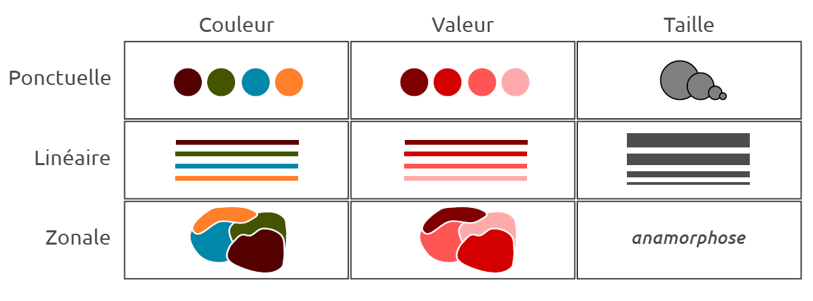
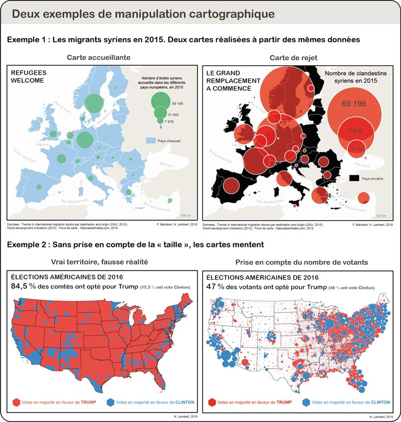

class: inverse, center, middle
# Rappel

```{r setup, include=FALSE}
getwd()
 setwd("C:/Users/romai/Documents/ens_ulm/cours/STATR/statsmappingwithR-master/statsmappingwithR-master/")
# options(htmltools.dir.version = FALSE)
# knitr::opts_chunk$set(fig.retina=2)
#knitr::opts_chunk$set(cache = F)
# 

# library(Cairo)
# library(cairoDevice)
# load("my_work_space.RData")
library(tidyverse)
library(knitr)
library(kableExtra)
library(sf)
library(mapsf)
 library(mapview)
library(viridis)
 
idf_sf <- st_read(dsn = "05_SpatialData/data/parispc_com.shp", 
                  crs = 2154, 
                  stringsAsFactors = F)
soc_eco <- read.csv("05_SpatialData/data/paris_soc_eco.csv")


soc_eco$INSEE_COM <- as.character(soc_eco$CODGEO)

idf_sf <- left_join(idf_sf, #objet 1 : l'objet sf
                    soc_eco, #objet 2 : le data.frame
                    by = "INSEE_COM") # l'identifiant commun


options(tidyverse.quiet = TRUE)
```


<style>
.html-widget {
    margin: auto;
}
</style>

```{css, echo=FALSE}
/* custom.css */
.left-code {
  color: #777;
  width: 38%;
  height: 92%;
  float: left;
}
.right-plot {
  width: 60%;
  float: right;
  padding-left: 1%;
}
.plot-callout {
  height: 225px;
  width: 450px;
  bottom: 5%;
  right: 5%;
  position: absolute;
  padding: 0px;
  z-index: 100;
}
.plot-callout img {
  width: 100%;
  border: 4px solid #23373B;
}
```

---
# Rappel

- Pour ouvrir des données spatiales sous R, on utilise le package sf ;

- Le format *sf* stocke les formes géométriques et les données attributaires associées dans un même objet. Les variables et individus sont donc stockées dans un *data.frame*.

- Pour manipuler cet objet, on peut utiliser les verbes de *dplyr* (select, filter, mutate, group_by, *etc*);

- Ou les fonctions de géotraitement de _sf_ pour modifier/créer la donnée. 

- Les outils de visualisation pour explorer les données: plot, ggplot, mapview...

- Avant de basculer vers la cartographie de ces données avec des packages dédiés.

---
## Cartographier avec R, mais surtout cartographier...

- La composante technique est importante, mais pas essentielle. 

- Visualiser des données spatiales pour explorer un jeu de données ≠ Cartographier. 
<!-- l'essentiel : la cartographie est une démarche scientifique qui repose sur des normes et méthodes précises.
Visualiser de manière brute des données spatiales relève seulement d'une démarche exploratoire pour se familiariser avec la structure et le contenu d'un jeu de données (repérer les types de variables, les éventuelles valeurs manquantes, identifier des possibilités de traitement, des opérations de recodage à effectuer). -->

- Cartographie : normes de sémiologie graphique ; discours scientifique. 

- Sur la cartographie, deux références : 

  - [Manuel de cartographie](https://www.armand-colin.com/manuel-de-cartographie-principes-methodes-applications-9782200612856) ;
  - Béguin & Pumain, 2003, *La représentation des données cartographiques. Statistiques et cartograhie*, Belin. Chapitres 3 et 5. 


- Pour cartographier avec R, des ressources en ligne :

  - [Cartographie avec R](https://github.com/riatelab/mapsf) avec le package *mapsf* ; 
  - le blog [RGeomatic](https://rgeomatic.hypotheses.org/), du même package, très complet ; 
  - [Chapter 8 Making maps with R](https://geocompr.robinlovelace.net/adv-map.html), en anglais, avec le package *tmap.*  
  - le package *ggplot2*, de la suite *tidyverse* est le plus populaire pour la visualisation de données. il permet de cartographier des objets SF. Voir par exemple ce [manuel en ligne](https://cengel.github.io/R-spatial/mapping.html).
  


---
class: inverse, center, middle

# La sémiologie graphique

---
## Sémiologie graphique

La cartographie utilise un langage cartographique. 

Celui-ci utilise des **variables visuelles** que l'on applique aux formes géométriques (points, lignes, polygones).

Jacques Bertin propose 6 variables (*La sémiologie graphique*, 1967) : la taille, la valeur (ou la teinte) , la couleur, la forme, l'orientation et le grain. <!-- Comme le rappellent Lambert et Zanin, c'était à l'époque du Noir et Blanc.  -->

<!-- De manière pragmatique, 3 variables visuelles sont à retenir : couleur, taille et forme.  -->

L'utilisation de ces variables visuelles, soit la sémiologie graphique, varie selon la nature des données et le type de variables.


---
## Sémiologie graphique : 3 variables

```{r, echo = F, fig.align="center", out.width="100%"}

```
.center[Source : Hadrien Commenges, 2018, "Sémiologie graphique et travail de l’image", Université Paris I]

---

Dans R, les fonctions des *packages* comportent des arguments pour choisir, tester et modifier ces variables visuelles, de manière quasi-automatique.

En amont, la réflexion scientifique et méthodologique est nécessaire et primordiale. Des connaissances en statistiques descriptives sont donc requises, notamment sur l'enjeu et les méthodes de discrétisation. 


---
class: inverse, center, middle
# Cartographier : produire un message. 

---
### Cartographier : produire un message. 


```{r, eval = T, echo = F,fig.align="center", out.width="70%", out.height="70%"}

```


---
## Cartographier : produire un message. 

Des références sur la cartographie : 

- [How Charts Lie: Getting Smarter About Visual Information](http://www.thefunctionalart.com/p/reviews.html), d'Alberto Cairo (University of Miami) ; 
- [Le Carnet (neo)cartographique](https://neocarto.hypotheses.org/), animé par Nicolas Lambert (UMS RIATE).


---
class: inverse, center, middle

# La couleur

---

### Les couleurs dans R

Une couleur peut s'appeler par son nom (en général en anglais, ex : "*blue*") ou par son code HEX ("#0000FF")

L'argument utilisé est *col*, pour *color*. On peut désigner les couleurs souhaitées, en les nommant par une chaine de charactères (un nom ou un [HEX code](https://htmlcolorcodes.com/fr/)).


.pull-left[

```{r}
plot(st_geometry(idf_sf))
```


]

.pull-right[
```{r}
plot(st_geometry(idf_sf),
col = "khaki4")  #argument
```
]

---
### Les couleurs dans R

R contient [657](http://www.stat.columbia.edu/~tzheng/files/Rcolor.pdf) couleurs. 

```{r, echo = F, fig.align="center"}

par(mfrow = c(2, 2))
plot(st_geometry(idf_sf),
col = "slateblue2", main = "slateblue2") 
plot(st_geometry(idf_sf),
col = "darkgoldenrod", main = "darkgoldenrod") #argument
plot(st_geometry(idf_sf),
col = "hotpink1", main = "hotpink1") #argument
plot(st_geometry(idf_sf),
col = "tomato", main = "tomato") #argument


```

---
### Les packages de couleur

Manipuler des couleurs sous R, c'est manipuler des vecteurs !
```{r, eval = F}
col = "blue"
col = c("blue", "red") # deux couleurs
col = c("0000FF") #Hex code
```

De **très nombreux packages** permettent de choisir des palettes de couleurs : 
- les *packages* de cartographie et *data viz* ont quelques palettes en stock : 
- d'autres *packages* sont spécifiquement développés pour la couleur ; 

Le principe reste le même : nommer la palette désirée avec un argument ; préciser le nombre de couleurs souhaité dans un autre argument (souvent *n = X*). 

---
### Les packages de couleur

Pour la cartographie : 

- le package [RColorBrewer](https://colorbrewer2.org/#type=sequential&scheme=BuGn&n=3) propose des palettes de type continue (gradient de couleur), divergente (gradient divergent, de type chaud-froid) ou qualitative (une couleur par modalité de la variable).

```{r, fig.align= "center", out.height="10%"}
library(RColorBrewer)

display.brewer.all() #affiche toutes les palettes
# display.brewer.pal(n = 8, name = 'Dark2') 
# display.brewer.pal(n = 8, name = 'Oranges')
# display.brewer.pal(n = 8, name = 'Spectral')
```

---
### Les packages de couleur 


- le package *rcartocolor* proposé par l'entreprise [CARTO](https://carto.com/carto-colors/) : 

```{r, fig.align="center"}
library(rcartocolor)
display_carto_all()
```


---
### Les packages de couleur 

- le package [viridis](https://cran.r-project.org/web/packages/viridis/vignettes/intro-to-viridis.html), utilisé par défaut par le package *mapview.*
- échelles de couleurs adaptées aux différents types de daltonisme et compatibles avec l'impression en noir et blanc

```{r, echo = F, fig.align="center"}
x <- y <- seq(-8*pi, 8*pi, len = 40)
r <- sqrt(outer(x^2, y^2, "+"))
filled.contour(cos(r^2) * exp(-r/(2*pi)), 
               axes = FALSE,
               color.palette = viridis,
               asp = 1)
```
---
- le *package* [wesanderson](https://www.datanovia.com/en/blog/top-r-color-palettes-to-know-for-great-data-visualization) propose des palettes d'après les films du réalisateur Wes Anderson. 

```{r, echo=F, warning=F}
par(mfrow = c(1, 2))
library(wesanderson)
```

.pull-left[
```{r, fig.align="center", warning=F, out.width="30%"}
wes_palette("Darjeeling1")
```
]

.pull-right[
```{r, fig.align="center", warning=F, out.width="30%"}
wes_palette("GrandBudapest2")
```
]


---
### Les couleurs dans R


**Bilan technique** - Appeler une palette de couleur consiste à appeler un *vecteur* composé de chaines de caractères, qui renvoient à des codes couleurs.  

```{r, eval = F}
col = viridis(2) #vecteur de taille 2
```

```{r, eval = T}
viridis(2) # éléments du vecteur
```
Cette [page internet](https://github.com/EmilHvitfeldt/r-color-palettes) recense toutes les palettes et packages développés pour la couleur. 

**Bilan scientifique** - le choix des couleurs est dicté par : 

- le type de variable (quanti / quali) ; 
- le message de la carte (couleur = charge symolique, connotation culturelle) ; 
- les qualités esthétiques (une carte doit être agréable à regarder ; distinction fond de carte / données à cartographier) ; 
- le public visé et les contraintes d'édition.


---
## Sémiologie : un choix esthétique et scientifique. 

Selon que la variable soit **quantitative** (stock / ratio) ou **qualitative** (nominal / ordinal), différentes normes s'imposent. 

Dans R, l'exploration des données a donc pour enjeu d'identifier le type de variables.

*Rappel : glimpse(), summary(), table(), plot(), mapview()*.


---
## Composition et habillage

Une carte comporte **obligatoirement** : 

- un titre clair et court, intégré au graphique ; 
- une légende hiérarchisée et équilibrée d'un point de vue graphique ; 
- une échelle ;
- des sources : nom de l'auteur et origine des données (institution, date).

Sous R, l'ensemble de ces éléments est paramétré par les *arguments* de chaque *fonction.*


---
class: inverse, center, middle

# Le package *mapsf*

Successeur du package _cartography_:
- développé à partir de _sf_;
- compatible avec l'écriture en _%>%_ 


---
## La carte typologique : production, habillage et sauvegarde

Elle permet de représenter une variable qualitative. 


```{r, eval = F}
library(mapsf)

# Fond de carte (aucune variable)
mf_map(x = objet_sf, col = "orange", 
       border = "white")

# Variable représentée

mf_map(x = objet_sf, type = "type", var = "VARIABLE",
       leg_title = "TITRE = NOM DE LA VARIABLE", add = TRUE)

# Habillage de la carte
mf_layout(title = "Titre", 
          credits = "Sources: Données, 2021",
          scale = TRUE,
          arrow = TRUE,
          frame = FALSE)
```


---
### Fonction de base


.left-code[
```{r plot-label0, eval=FALSE}


mf_map(idf_sf, type = "typo",
  var = "NOM_DEPT") 
```
]

.right-plot[
```{r plot-label0-out, ref.label="plot-label0", echo=FALSE}
```
]

---
### Choix d'une palette de couleur

.left-code[
```{r plot-labelA, eval=FALSE}

mf_map(idf_sf, type = "typo",
  var = "NOM_DEPT",
  pal = viridis(4)) 

```
]

.right-plot[
```{r plot-labelA-out, ref.label="plot-labelA", echo=FALSE}
```
]


---
### Légende

.left-code[
```{r plot-label, eval=FALSE}

mf_map(x = idf_sf, 
       type = "typo", 
       var = "NOM_DEPT",
       leg_title = "Départements",  
       leg_pos = "topleft")

```
]

.right-plot[
```{r plot-label-out, ref.label="plot-label", echo=FALSE}
```
]


---
### Habillage

.left-code[
```{r plot-label1, eval=FALSE}
mf_map(x = idf_sf, 
       type = "typo", 
       var = "NOM_DEPT",
       leg_title = "Départements",  
       leg_pos = "topleft")

mf_layout(title = "La métropole parisienne", 
          credits = "Auteur: R. Leconte, 2021. Données: INSEE, 2007",
          scale = TRUE,
          arrow = FALSE)
```
]

.right-plot[
```{r plot-label1-out, ref.label="plot-label1", echo=FALSE}
```
]

---
### Export et sauvegarde

On peut exporter les graphiques au format PDF, JPG, PNG...

- Soit on clique sur "Export" et on sauvegarde  à la main..

--

- Soit on code avec les fonctions pdf() ou png(). Intérêt : reproductible. Voir des explications [ici](https://www.datamentor.io/r-programming/saving-plot/) ou [là](http://larmarange.github.io/analyse-R/export-de-graphiques.html).

---
### Export et sauvegarde


```{r, eval = F}
# 1. D'abord, on place en haut la fonction pour sauvegarder

pdf("img/Carte.pdf", # Emplacement et nom du fichier
width=7, #largeur en pouces - une page A4 fait environ 8 x 11
height=7 , #hauteur en pouces
useDingbats=FALSE)

# Ou bien 
png("img/Carte.png", # Emplacement et nom du fichier
    width=7, #largeur en pouces 
    height=7 , #hauteur en pouces
    res = 300) # résolution en pixels par pouce (DPI) - 300 est idéal pour imprimer

#2. Puis on place TOUTES les lignes de code pour produire la carte

mf_map(...names())

#3. On conclut avec la fonction  qui 
# "clotûre" les fonctions pdf() ou png()


# On exécute le tout ! 
```
On récupère un fichier *.pdf* ou *.png* dans le dossier défini.

---
### Export et sauvegarde

Chaque fois que l'on veut changer un titre, un palette de couleurs, une variable *etc*, il suffit de modifier la ligne de code correspondante, et de tout exécuter. 

Le fichier précédent est automatiquement remplacé par cette nouvelle version. 

On peut ainsi produire, à la chaîne, autant de cartes que nécessaire, en faisant du copier-coller, voire en écrivant des boucles (niveau plus avancé).


---
# La carte de symboles proportionnels


```{r, echo = T, eval = F}

mf_map(idf_sf, col = "grey90", border = "grey50")

mf_map(idf_sf, 
       var = "POPULATION",
       type = "prop",
       leg_title= "Population en miliers",
       leg_pos = "topleft",
       inches = 0.1,
       symbol = "circle",
       col = "darkblue",
       add = TRUE)

mf_layout(title = "Population en Ile de France", 
    credits = "Auteur: R. Leconte, 2021. Données : INSEE, 2007",
    frame = TRUE,
    arrow = FALSE,
    scale = TRUE)

mf_arrow(pos = "topright")


```

---
# La carte de symboles proportionnels

```{r, echo = F, fig.align="center"}


mf_map(idf_sf, col = "grey90", border = "grey50")

mf_map(idf_sf, 
       var = "POPULATION",
       type = "prop",
       leg_title= "Population en miliers",
       leg_pos = "topleft",
       inches = 0.1,
       symbol = "circle",
       col = "darkblue",
       add = TRUE)

mf_layout(title = "Population en Ile de France", 
    credits = "Auteur: R. Leconte, 2021. Données : INSEE, 2007",
    frame = TRUE,
    arrow = FALSE,
    scale = TRUE)

mf_arrow(pos = "topright")

```

---
# La carte typologique : figuré ponctuel


```{r, eval = F, echo = F}

stations <- st_read("C:/Users/romai/Documents/ens_ulm/cours/STATR/geodata/emplacement-des-gares-idf-data-generalisee/emplacement-des-gares-idf-data-generalisee.shp")

# projeter les données 
stations <- st_transform(stations, crs = 2154)

# sélection spatiale
stations <- st_intersection(stations, idf_sf)

# créer une variable à modalité unique (1 symbole quel que soit le mode de transport)
stations$station <- 1
```

---
## La carte typologique : figuré ponctuel

```{r, eval = F}

mf_map(idf_sf)

mf_map(stations, 
       type = "symb", 
       var = "station", 
       pch = 22, # forme du symbole
       cex = 0.5, # taille du symbole
       pal = "darkgreen", 
       border = NA,
       add = TRUE)

mf_layout(title = "Les stations de transport en commun", 
          credits = "Données: Ile de France Mobilités, 2021", 
          scale = TRUE,
          arrow = FALSE)


```

---
## La carte typologique : figuré ponctuel

```{r, eval = F, echo = F, fig.align= "center", out.height="100%"}

mf_map(idf_sf)

mf_map(stations, 
       type = "symb", 
       var = "station", 
       pch = 22, # forme du symbole
       cex = 0.5, # taille du symbole
       pal = "darkgreen", 
       border = NA,
       add = TRUE)

mf_layout(title = "Les stations de transport en commun", 
          credits = "Données: Ile de France Mobilités, 2021", 
          scale = TRUE,
          arrow = FALSE)
```
---

# La discrétisation

---
## Variable quantitative : la discrétisation

<blockquote>
"Perdre le moins possible d’information, du point de vue de la statistique, reviendrait à cartographier toutes les valeurs (…). Or, nous savons que les règles de la perception visuelle contredisent cette exigence, la lisibilité (…) étant d’autant plus grande que le nombre de signes distincts, donc de classes, est petit."
.right[-- <cite>Béguin et Pumain, 1994</cite>]
</blockquote>

Il faut donc rendre *les caractères continus discrets* : on parle de discrétisation.

On passe d'une *variable quantitative continue* à une *variable qualitative ordonnée*.

C'est une démarche statistique et visuelle.

---
## Discrétiser : découper une série en classes. 

- Discrétiser revient à opter pour un compromis.

  - Résumer au mieux la distribution (conserver l’hétérogénéité des unités) = *le plus grand nombre de classes*.
  - Construire une carte efficace (synthétiser) = *un faible nombre de classes*.
  - Choisir des combinaisons de variables visuelles pour restituer les spécificités de la distribution statistique = *sémiologie graphique*.

- Réduire l'information pour cartographier entraine donc des enjeux :

  - Conserver l’ordre de grandeur ;
  - Conserver la forme de la distribution ;
  - Conserver la dispersion ;
  - Décider de conserver ou non les singularités (que faire des unités spatiales aux valeurs extrêmes ?).
  
---
## Les méthodes de discrétisation 

- Il faut d'abord étudier la distribution de la variable : 
      - avec un histogramme ; 
      - avec un [boxplot](https://juba.github.io/tidyverse/08-ggplot2.html#geom_boxplot) ;
      - avec une [courbe de distribution](https://juba.github.io/tidyverse/08-ggplot2.html#geom_density)

- Le choix d'une méthode de discrétisation est déterminée par la distribution de la variable. 

- Des références : 

  - Lambert et Zanin, 2019, [Manuel de cartographie](https://www.armand-colin.com/manuel-de-cartographie-principes-methodes-applications-9782200612856), Armand Colin ;
  
  - "Chapitre 5 : Découper en classes les séries quantitatives", Béguin & Pumain, 2003, *La représentation des données cartographiques. Statistiques et cartographie*, Belin. 

---
# La discrétisation sur R

- Discrétiser  : découper un vecteur de valeurs numériques...
- ... pour obtenir un plus petit vecteur...
- ... que l'on va associer à une palette de couleurs (et son vecteur !).


- le package _mpasf_ comporte des fonctions pour cartographier une variable quantitative en la discrétisant. 

---
## Carte choroplèthe


.left-code[
```{r,  plot-labelX, eval=FALSE}
mf_map(idf_sf, type = "choro",
var = "TXCHOMA07")
```
]

.right-plot[
```{r plot-labelX-out, ref.label="plot-labelX", echo=FALSE}
```
]


---
## Carte choroplèthe

- la fonction *mf_get_breaks()* renvoie le vecteur produit par la méthode de discrétisation mentionnée.

```{r, echo = T, fig.align="center", out.height="40%"}
bks <- mf_get_breaks(idf_sf$TXCHOMA07,
                 breaks= "quantile",
                 nbreaks = 4)
bks
```

- Au sein de la fonction *mf_map()*, on paramètre les arguments suivants : 

  - *breaks* : "quantile", "jenk", "sd", "q6", "geom" etc.
  - *nbreaks* : nombre de classes attendues.
  - *pal* : un vecteur de couleurs. 
  
---

### Seuils naturels

Les bornes sont crées par observation de la distribution : repérer, à l'oeil, des ruptures ou des seuils naturels.

On ne peut pas utiliser une telle méthode pour comparer des variables. 

.left-code[

```{r, plot-labelZ, eval=FALSE, fig.align="center"}

bks <- c(6, 10, 15, 30)

mf_map(idf_sf)
mf_map(idf_sf, 
       var = "TXCHOMA07", 
       type = "choro",
       breaks = c(6, 10, 15, 30),
       pal = viridis(3),
       leg_title = "Taux de chômage\n(seuils observés)",
       add = T)

mf_layout(title = "Le chômage en IDF", 
    credits = "Auteur: R. Leconte, 2021. Données: INSEE, 2007",
    arrow = FALSE)

```

]

.right-plot[
```{r plot-labelZ-out, ref.label="plot-labelZ", echo=FALSE, fig.align="center"}
```
]
---
### Amplitude égale

Les classes possèdent la même amplitude. Méthode qui permet de comparer plusieurs variables. 

.left-code[
```{r,  plot-label2, eval=FALSE, fig.align="center"}
mf_map(idf_sf)
mf_map(idf_sf, 
       var = "TXCHOMA07", 
       type = "choro",
       breaks = c(5,10,15,20, 25),
       pal = viridis(4),
       leg_title = "Taux de chômage",
       add = T)

mf_layout(title = "Le chômage en IDF", 
    credits = "Auteur: R. Leconte, 2021. Données: INSEE, 2007",
    arrow = FALSE)

```
]

.right-plot[
```{r plot-label2-out, ref.label="plot-label2", echo=FALSE, fig.align="center"}
```
]
---
### Effectifs égaux (quartiles)

La méthode des effectifs égaux est appropriée lorsque la distribution est asymétrique. Elle permet de comparer plusieurs variables. 

Ici, les bornes sont construites en 4 classes d’effectifs égaux : des quartiles. 

```{r, echo = F, fig.align="center"}

mf_map(idf_sf)
mf_map(idf_sf, 
       var = "TXCHOMA07", 
       type = "choro",
       breaks = "quantile",
       nbreaks = 4,
       pal = viridis(4),
       leg_title = "Taux de chômage\n(quartiles)",
       add = T)

mf_layout(title = "Le chômage en IDF", 
    credits = "Auteur: R. Leconte, 2021. Données: INSEE, 2007",
    arrow = FALSE)

```

### Effectifs égaux (déciles)

Les bornes sont ici construites en 10 classes d’effectifs égaux.

```{r, echo = F, fig.align="center"}
mf_map(idf_sf)
mf_map(idf_sf, 
       var = "TXCHOMA07", 
       type = "choro",
       breaks = "quantile",
       nbreaks = 10,
       pal = viridis(10),
       leg_title = "Taux de chômage\n(déciles)",
       add = T)

mf_layout(title = "Le chômage en IDF", 
    credits = "Auteur: R. Leconte, 2021. Données: INSEE, 2007",
    arrow = FALSE)

```

---
### Moyenne et écart-type

Les classes sont déterminées selon une fraction d’écart-type par rapport à la moyenne. Cette méthode est valide lorsque la distribution est symétrique. On peut éventuellement comparer d'autres variables *si ces dernières ont aussi une distribution symétrique*. 

```{r, echo = F, fig.align="center"}
mf_map(idf_sf)
mf_map(idf_sf, 
       var = "TXCHOMA07", 
       type = "choro",
       breaks = "sd",
       nbreaks = 2,
       pal = viridis(3), 
       leg_title = "Taux de chômage\n(discrétisation moyenne + écart-type)",
       leg_pos = "topleft",
       add = T)

mf_layout(title = "Le chômage en IDF", 
    credits = "Auteur: R. Leconte, 2021. Données: INSEE, 2007",
    arrow = FALSE)

```

---
### Jenks

Maximise la variance inter-classe et minimise la variance intra-classe. 

Utile et rapide pour dégager des groupes cohérents, mais ne permet pas la comparaison. 

```{r, echo = F, warning=F, fig.align="center"}
mf_map(idf_sf)
mf_map(idf_sf, 
       var = "TXCHOMA07", 
       type = "choro",
       breaks = "jenks",
       nbreaks = 4,
       pal = viridis(4),
       leg_title = "Taux de chômage\n(Jenks)",
       add = T)

mf_layout(title = "Le chômage en IDF", 
    credits = "Auteur: R. Leconte, 2021. Données: INSEE, 2007",
    arrow = FALSE)

```


---
## Conclusion 

- La discrétisation détermine l'apparence et le message de la carte ; 

- Toute carte doit préciser en légende la méthode de discrétisation retenue ; 

- La discrétisation doit permettre de renseigner sur la position d'une unité spatiale par rapport à la distribution de la variable. 

- Une bonne pratique consiste à associer à la carte un histogramme.


---

class: center, middle

# Fin

Slides crées avec le package [**xaringan**](https://github.com/yihui/xaringan).

