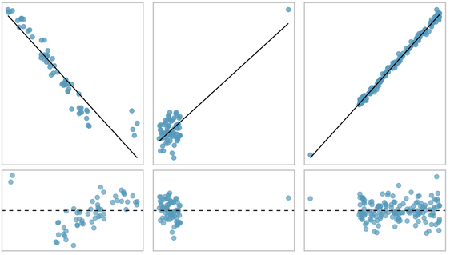
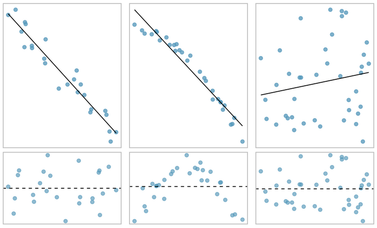
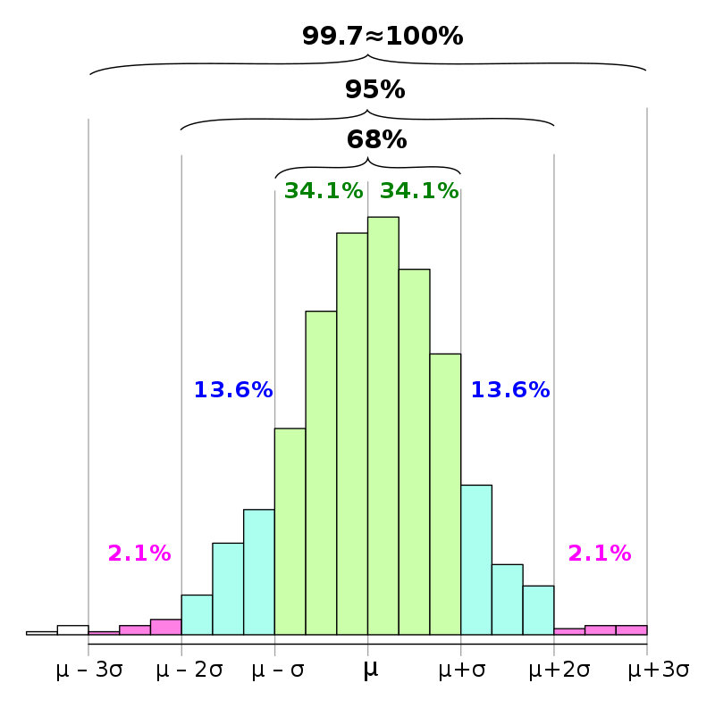

class: inverse, center, middle

# Retours


```{r setup, include=FALSE}

setwd("C:/Users/jmigozzi/Dropbox/ENS/Cours/FormationR/statsmappingwithR/statsmappingwithR")
# options(htmltools.dir.version = FALSE)
# knitr::opts_chunk$set(fig.retina=2)
#knitr::opts_chunk$set(cache = F)
# 

# library(Cairo)
# library(cairoDevice)
# load("my_work_space.RData")
library(tidyverse)
library(knitr)
library(kableExtra)
library(sf)
library(spData)
library(mapview)
library(tmap)
library(cartography)
library(viridis)
library(ggthemes)
library(hrbrthemes)
library(tmap)


idf_sf <- st_read(dsn = "02_SpatialData/data/parispc_com.shp", 
                  crs = 2154, 
                  stringsAsFactors = F)
soc_eco <- read.csv("02_SpatialData/data/paris_soc_eco.csv")


soc_eco$INSEE_COM <- as.character(soc_eco$CODGEO)

idf_sf <- left_join(idf_sf, #objet 1 : l'objet sf
                    soc_eco, #objet 2 : le data.frame
                    by = "INSEE_COM") # l'identifiant commun

movies_paris <- st_read(dsn = "03_DataWrangling/data/lieux-de-tournage-a-paris/lieux-de-tournage-a-paris.shp", 
                        crs = 4326, 
                        stringsAsFactors = F)


options(tidyverse.quiet = TRUE)
```

---
### Vérifier ses données

- On vérifie la qualité de ses données, qui sont *toujours* remplies d'erreurs. 
  - combien d'arrondissements ? 


- On ne calcule pas un coefficient de corrélation sur deux tableaux différents
  - à moins d'être sur qu'ils sont dans le même ordre...

---
### Vérifier ses données

```{r, message = F, warning = F}
movies_arrdt <- movies_paris %>% 
  st_set_geometry(NULL) %>%
  group_by(ardt_lieu) %>% 
  summarise(Total = n())

table(movies_arrdt$ardt_lieu)


```

---
### Recoder et nettoyer ses données

```{r, message = F, warning = F}
movies_arrdt <- movies_paris %>% 
  st_set_geometry(NULL) %>%
  mutate(Type = ifelse(type_tourna == "Long métrage", "Film", 
                       "Série")) %>%
  mutate(ardt_lieu = ifelse(ardt_lieu == "75116", "75016", 
                              ardt_lieu)) %>%
  mutate(ardt_lieu = as.numeric(ardt_lieu)) %>%
  filter(ardt_lieu < 80000) %>%
  group_by(ardt_lieu, Type) %>% 
  summarise(Total = n())

table(movies_arrdt$ardt_lieu)

```

---
### Préparer ses données

```{r, message = F, warning = F}
movies_arrdt <- movies_paris %>% 
  st_set_geometry(NULL) %>%
  mutate(Type = ifelse(type_tourna == "Long métrage", "Film", "Série")) %>%
  mutate(ardt_lieu = ifelse(ardt_lieu == "75116", "75016", ardt_lieu)) %>%
  mutate(ardt_lieu = as.numeric(ardt_lieu)) %>%
  filter(ardt_lieu < 80000) %>%
  filter(Type == "Film") %>%
  group_by(ardt_lieu) %>% 
  summarise(Film = n())

serie_arrdt <- movies_paris %>% 
  st_set_geometry(NULL) %>%
  mutate(Type = ifelse(type_tourna == "Long métrage", "Film", "Série")) %>%
  mutate(ardt_lieu = ifelse(ardt_lieu == "75116", "75016", ardt_lieu)) %>%
  mutate(ardt_lieu = as.numeric(ardt_lieu)) %>%
  filter(ardt_lieu < 80000) %>%
  filter(Type == "Série") %>%
  group_by(ardt_lieu) %>% 
  summarise(Série = n())

ardt <- merge(movies_arrdt, serie_arrdt, by = "ardt_lieu" )
```

---
### Visualiser ses données

.left-code[
```{r plot-labelS1, eval=FALSE}

library(ggrepel)

ggplot(ardt, aes(Film, Série, label = ardt_lieu)) +
  geom_point(size = 4) +
  geom_label_repel() +
  theme_bw() 
```
]

.right-plot[
```{r plot-labelS1-out, ref.label="plot-labelS1", echo=FALSE, message=F, warning=F}
```
]


---
### Visualiser ses données : une droite ? 

.left-code[
```{r plot-labelS2, eval=FALSE}

library(ggrepel)

ggplot(ardt, aes(Film, Série, label = ardt_lieu)) +
  geom_point(size = 4) +
  geom_label_repel() +
  geom_smooth(method = "lm", se = F) +
  theme_bw() 


```
]

.right-plot[
```{r plot-labelS2-out, ref.label="plot-labelS2", echo=FALSE, message=F, warning=F}
```
]


---
class: inverse, center, middle

# La régression linéaire

### Le couteau suisse de la modélisation

---
### Une méthode statistique

- Déterminer une droite pour un jeu de données : on parle d'ajuster une droite (*fiting*) à un nuage de points. 

- Modéliser la relation entre *X* et *Y* en traçant une droite. 

- Cette ligne droite se nomme la **droite de régression**.

--

<br>

- La Méthode des Moindres Carrés (MCO) fait partie des techniques de régression les plus connues (*Ordinary Least Squares* en anglais - OLS).

- Il s’agit : 
  1. de calculer la droite des moindres carrés ordinaires, qui minimise le carré des résidus. On obtient donc une équation qui modélise la relation entre X et Y.
  2. d'évaluer la qualité de ce modèle, en mesurant son pouvoir explicatif. 
  3. de cartographier les écarts à ce modèle (les résidus).

---
### Tracer un nuage de points


.left-code[
```{r plot-label1, eval=FALSE}
# Scatter plot

ggplot(idf_sf, aes(PCAD07, RFUCQ207)) +
  geom_point(size = 4,
             alpha = 0.5) + 
  theme_bw(base_size = 24) +
  labs(x = "% de cadres en 2007", y = "Revenu médian en 2007")

# Corrélation
cor(idf_sf$PCAD07, idf_sf$RFUCQ207)
```
]

.right-plot[
```{r plot-label1-out, ref.label="plot-label1", echo=FALSE}
```
]

---
### Visualiser chaque distribution


.left-code[
```{r plot-label2, eval=FALSE}
library(ggExtra)

# Scatter plot
p <- ggplot(idf_sf, aes(PCAD07, RFUCQ207)) +
  geom_point(size = 4,
             alpha = 0.5) + 
  theme_bw(base_size = 24) +
  labs(x = "% de cadres en 2007", y = "Revenu médian en 2007")

# Marginal boxplot
ggMarginal(p, type = "boxplot", size = 10)

```
]

.right-plot[
```{r plot-label2-out, ref.label="plot-label2", echo=FALSE}
```
]

---
### Tracer une droite


.left-code[
```{r plot-label3, eval=FALSE}
ggplot(idf_sf, aes(PCAD07, RFUCQ207)) +
  geom_point(size = 4,
             alpha = 0.5) + 
  theme_bw(base_size = 24) +
  labs(x = "% de cadres en 2007", y = "Revenu médian en 2007") +
  geom_smooth(method = "lm")
```
]

.right-plot[
```{r plot-label3-out, ref.label="plot-label3", echo=FALSE, message = F, warning = F}
```
]

---
### Equation de la droite de régression

.center[Formule pour une ligne droite]

$$ \small Y_i = a + bx $$
- X est la variable explicative
- Y est la variable dépendante
- a et b sont des coefficients :  
  - a est l'intersection, soit la valeur de X quand Y = O ; 
  - b est la pente

---
### Equation de la droite de régression


.center[Formule pour un modèle de régression linéaire]

$$ \small \hat{Y_i}= \beta_0 + \beta_1 X_i + \epsilon_i $$
- Xi est la valeur de la variable explicative.
- $\hat{Y_i}$ est la valeur estimée de la variable à expliquer.
- $\beta_0$ est l'intersection (*intercept*)
- $\beta_1$ est la pente, ou le coefficient de régression 
- $\epsilon_i$ est l'erreur aléatoire : le *résidu*.


--

<br>
.center[.content-box-red[Un modèle ?]]

<br>

.center[.content-box-blue[*Data* = *Fit* (ce qui est capturé par le modèle) + *Residual* (ce qui ne l’est pas)]]

---
### Méthode des moindres carrés

.pull-left[
- Objectif : obtenir les plus petits résidus possibles. 

- Méthode : tracer une droite qui *minimise le carré des résidus*. 

- Minimiser les écarts entre la droite (les valeurs prédites par l'équation) et les points (les données empiriques).

- résidu = la différence entre la donnée observée et la donnée prédite par le modèle, soit $\small \epsilon_i = y_i - ax_i - b$
]

.pull-right[
```{r, echo=F, warning=F, fig.align="center", out.width="100%", fig.align="center",  message=F}

model <- lm(RFUCQ207 ~ PCAD07, data = idf_sf)

idf_sf$Residuals <- residuals(model)
idf_sf$Predicted <- predict(model)


ggplot(idf_sf, aes(x = PCAD07, y = RFUCQ207)) +
   geom_point() +
    geom_smooth(method = "lm", se = FALSE, col = "black", size = 1.5) +  # Plot regression slope

  geom_segment(aes(xend = PCAD07, yend = Predicted), alpha = .5) +  # alpha to fade lines
  geom_point(aes(fill = Residuals), size = 5, shape = 21) +  # Color mapped here 
  scale_fill_gradient2(low = "blue", mid = "white", high = "red") +  # Colors to use here
  theme_bw(base_size = 24) +
  guides(fill = FALSE)  +
  labs(x = "% de cadres en 2007", y = "Revenu médian en 2007") 
```
]

---
### Application sur R

- Utilisation de la fonction *lm()*, pour *linear models*.

<br><br>

.center[lm(Y ~ X, data = df = tableau)]

<br><br>

.center[lm(Y ~ X, data = data.frame *ou* objetsf)]

<br><br>
.center[lm(RFUCQ207 ~ PCAD07, data = idf_sf)]

---
### Application sur R


```{r}
lm(RFUCQ207 ~ PCAD07, data = idf_sf)
```


- La valeur de l'intercept, ou $\beta_0$, est 10476.
- La valeur de la pente, ou $\beta_1$, est 432.
- On obtient la formule suivante :


$$\tiny \operatorname{RFUCQ207} =  \beta_0 + \beta_{1}(\operatorname{PCAD07}) + \epsilon$$
Soit : 

$$\tiny \operatorname{RFUCQ207} = 10476 + 432(\operatorname{PCAD07}) + \epsilon$$


```{r, echo = F, eval = F, include = F}
# Calcul modèle

model <- lm(RFUCQ207 ~ PCAD07, data = idf_sf)
summary(model)
equatiomatic::extract_eq(model)
equatiomatic::extract_eq(model, use_coefs = T)


```


---
### Visualiser le modèle 

.left-code[
```{r plot-label4, eval=FALSE, warning=F, message = F}

# Valeur estimée
idf_sf <- idf_sf %>% 
  mutate(RevenusPredict = 10476+432*PCAD07)

 #Modèle
ggplot(idf_sf, aes(x = PCAD07, 
                   y = RevenusPredict)) +
  #valeurs prédites
geom_point(fill = "black", 
           size = 4, shape = 21) + 
  # écarts
  geom_segment(aes(xend = PCAD07, 
                   yend = RFUCQ207), 
             alpha = .5) + 
  
  # Données empiriques
geom_point(data = idf_sf, aes(PCAD07,RFUCQ207, 
                              fill = Residuals), 
           size = 5, 
           shape = 21) + 
  # droite de régression
geom_smooth(data = idf_sf, 
            aes(PCAD07,RFUCQ207),
            method = "lm", 
            se = F,
            col = "red") + 
  #couleurs pour résidus
scale_fill_gradient2(low = "blue", 
                     mid = "white", 
                     high = "red") + 
  
  #habillage
theme_bw(base_size = 24) +
guides(fill = FALSE)  +
labs(x = "% de cadres en 2007",
     y = "Revenu médian en 2007") 
```
]

.right-plot[
```{r plot-label4-out, ref.label="plot-label4", echo=FALSE, message = F, warning=F}
```
]

---
### Interprétation

$$\tiny \operatorname{RFUCQ207} = 10476 + 432(\operatorname{PCAD07}) + \epsilon$$


- Quand X augmente d'une unité, Y augmente de $\beta_{1}$ unité, au dessus de la valeur constante $\beta{0}$.

- Quand le pourcentage de cadre augmente de 1% (X), le revenu médian augmente de 432 unités (Y), au dessus de la valeur 10476.

- Quel serait le revenu estimé pour un taux de 40% et 41 % ?

--

```{r}
a <- predict(model, data.frame(PCAD07 = c(40, 41)))
a

a[2] - a[1]

```


---
class: middle, inverse, center

# Estimer un modèle

### Coefficient et résidus

---
### Quantifier l'ajustement d'un modèle 

- Le rapport entre variance de la variable estimée et variance de la variable observée permet de quantifier le pouvoir explicatif du modèle.

- Ce rapport est noté $R^2$ : c'est le coefficient de détermination. Il est égal au carré du coefficient de corrélation (cf *pearson*).

- Il peut être interprété comme une pourcentage de la variance expliquée : “*le modèle explique 65% de la variation de la variable étudiée*”.

---
### Calculer un R2 


$$ \tiny R^2 = \frac{VAR(y_e)}{VAR(y)} = 1 - \frac{VAR(\epsilon)}{VAR(y)} $$

```{r}
# Somme des résidus au carré
sum_res <- sum(idf_sf$Residuals^2)
# Moyenne de Y
mean_y <- mean(idf_sf$RFUCQ207)
# Ecart à la moyenne au carré
ecart <- (idf_sf$RFUCQ207 - mean_y)^2
# R2 = somme des résidus / somme des écarts
1 - sum_res / sum(ecart)

```

.center[Le pourcentage de cadres explique 77% de la variance du revenu médian.]

---
### Application sur R 

```{r}
model <- lm(RFUCQ207 ~ PCAD07, data = idf_sf)

summary(model)
```


---
### Vérifier le modèle

- Le modèle de régression linéaire simple repose sur plusieurs hypothèses. 

- Normalité : les résidus doivent avoir une distrubution normale normalement répartis, donc avoir une distribution normale. Il faut donc regarder s'il n'y a rien d'anormal dans les résidus.

- Valeurs aberrantes : le modèle est trop influencé par le poids d'individus

--

- Le diagnostic d'un modèle passe par la visualisation :
  - *QQ-Plot* : les résidus selon leur quantiles théoriques d'après le modèle de régression. 
  - *Scatter plot* : relation entre valeurs ajustées et les résidus eux-mêmes. 

--
  
- La distribution des résidus doit être normale (répartition uniforme des points) : 
  - le long de la droite pour le *QQ-Plot* ;
  - de manière uniforme pour le *scatter plot*
  

  
---
### Diagnostic des résidus

```{r, fig.align="center", out.width="55%"}
par(mfrow= c(2, 2))
plot(model)

```

--

.center[Distribution anormale : le modèle de régression linéaire n'est pas approprié.]


---
### Repérer les *outliers*

- Repérer les valeurs aberrantes : une observation "anormale" d'après ce que le modèle prédit. 

```{r, fig.align="center", out.width="55%", echo = F}
plot(model, which=1)
```

--

.center[Une valeur aberrante = individu intéressant, à examiner de plus près.]

---
### Repérer les outliers

Les valeurs aberrante influencent fortement le tracé de la droite, et donc les résultats du modèle. 


```{r, echo = F, fig.align="center", out.width="75%"}

```
.center[.tiny[ Source : [Introduction to Modern Statistics](https://openintro-ims.netlify.app/intro-linear-models.html#resids)]]


<!-- D : There is a primary cloud and then a small secondary cloud of four outliers. The secondary cloud appears to be influencing the line somewhat strongly, making the least square line fit poorly almost everywhere. There might be an interesting explanation for the dual clouds, which is something that could be investigated. -->

<!-- E: There is no obvious trend in the main cloud of points and the outlier on the right appears to largely control the slope of the least squares line. -->

<!-- F: There is one outlier far from the cloud. However, it falls quite close to the least squares line and does not appear to be very influential. -->

---
### Exercice

- La figure ci-dessous propose les *scatterplots* de 3 jeux de données : 
  - la 1ere ligne montre la relation entre X et Y, avec une droite de régression. ; 
  - la 2e  montre les graphiques des résidus associés ; 

- Question 1 : Quelles tendances identifiez-vous à partir la distribution des résidus ? 
- Question 2 : Pour quel jeu de données le modèle de régression linéaire MCO vous semble-t-il pertinent ? 

```{r, echo = F, fig.align="center", out.width="50%"}

```
.center[.tiny[ Source : [Introduction to Modern Statistics](https://openintro-ims.netlify.app/intro-linear-models.html#resids)]]

---
### Solutions

- Data 1 : pas de tendance anormale dans la distribution des résidus. Répartition égale et *random* autour de la ligne en pointillés qui représente 0.

<br>
- Data 2 : on observe une nette tendance dans les résidus : une courbe, déjà visible dans le nuage de points, devient flagrante dans le graphique des résidus. Un modèle de régression linéaire MCO n'est pas adaptée ici. 

<br>

- Data 3 : Une relation linéaire et positive est discernable, mais elle est très faible. Pas d'anormalité dans les résidus. On peut raisonnablement tenter d'ajuster un modèle linéaire de type OLS.


---
class: middle, inverse, center

# La régression linéaire 

### Application géographique

---
### Une méthode commune appliquée à des données spatiales


- Mise en valeur des composantes spatiales de la relation entre deux variables ; 

  - cartographier les *écarts* au modèle (les *résidus*, soit les unités spatiales qui sont moins bien expliquées ou prédites par le modèle).
  
  <br>
  
.center[.content-box-blue[Cartographier un modèle statistique]]
   <br>

--

  - en identifiant des effets d'*autocorrelation spatiale* pour proposer une analyse quantifiée de la structure spatiale d'un phénomène et démontrer des effets de voisinage.
  
   <br> 
.center[.content-box-blue[Statistique spatiale : prendre en compte la distance dans le modèle]]
  <br>


---
### Cartographier les résultats d'un modèle linéaire 


```{r, fig.align="center", echo = F, message = F}
 ggplot(idf_sf, aes(x = PCAD07, y = RFUCQ207)) +
   geom_point() +
    geom_smooth(method = "lm", se = FALSE, col = "black", size = 1.5) +  # Plot regression slope

  geom_segment(aes(xend = PCAD07, yend = Predicted), alpha = .5) +  # alpha to fade lines
  geom_point(aes(fill = Residuals), size = 5, shape = 21) +  # Color mapped here 
  scale_fill_gradient2(low = "blue", mid = "white", high = "red") +  # Colors to use here
  theme_bw(base_size = 24) +
  guides(fill = FALSE)  +
  labs(x = "% de cadres en 2007", y = "Revenu médian en 2007")  

```

---
### Interpréter les résidus


Les  résidus  correspondent  alors  à  l’écart  qui  peut  exister  entre  ce  modèle  et  la relation  réelle.  

- Deux informations : 
  - la valeur (proche ou éloignée de 0 ); 
  - le signe (positif ou négatif). 


- Deux types de résidus : 
  - résidus positifs : valeur sous-estimée par le modèle
  - résidus négatifs : valeur sur-estimée par le modèle.

---
### Cartographier les résidus 

- Les résidus constituent donc une nouvelle variable quantitative que l’on peut discrétiser pour cartographier.

- Une carte des résidus mets donc évidence des phénomènes de différenciation spatiale : mettre en valeur les résidus positifs ou négatifs. 

- la valeur 0 qui traduit la conformité au modèle doit donc être mise en avant :
  - si le nombre de classes est pair, le 0 apparaît comme une limite de classe ;
  - si le nombre est impair (préférable) le 0 est inclus dans une *classe centrale* qui correspond aux individus proches ou égaux au modèle.

- Par convention, on choisit 2 palettes de couleur : l’une pour les résidus négatifs et l’autre pour les positifs. On en fait ensuite varier la teinte : plus la teinte de la couleur sera foncée, plus la valeur des résidus sera forte.

.center[C'est l'interprétation géographique de la carte qui est primordiale.]
---
### Rappel sur la distribution normale


```{r, fig.align="center", echo = F, out.width="70%"}

```
.center[.tiny[Source : [Wikipedia](https://fr.wikipedia.org/wiki/R%C3%A8gle_68-95-99,7#/media/Fichier:Empirical_rule_histogram.svg)]]


---
### Visualiser les résidus


```{r, fig.align="center"}
idf_sf$Residuals <- model$residuals
hist(idf_sf$Residuals)
```


---
### Application 

.left-code[
```{r plot-label5, eval=FALSE, warning=F, message = F}

#Normaliser résidus
idf_sf$Residuals <- as.vector(scale(model$residuals))

# CLassification

vec_breaks <- c(min(idf_sf$Residuals), 
                -2, 
                -1, 1, 
                2, 
                max(idf_sf$Residuals))

# objet sf pour département
dpt <- idf_sf %>%  
  group_by(CODE_DEPT) %>% 
  summarize(geometry = st_union(geometry))

#Carto

choroLayer(idf_sf, 
          var = "Residuals", 
          legend.title.txt = "Résidus",
          breaks = vec_breaks,
          legend.values.cex = 1.5,
          legend.values.rnd = 1,
          col = carto.pal(pal1 = "blue.pal", n1 =2, 
                          pal2 = "orange.pal", n2 = 3),
          legend.pos = "topleft")

plot(st_geometry(dpt), add = T, col = NA, lwd = 2)

layoutLayer("Cadres et revenu médian en Ile de France", 
author = "Auteur : J. Migozzi, 2020", 
sources ="Les écarts résultent d'une régression linéaire nentre le taux de cadres et le revenu médian en 2007.\nR2 : 0,77.\nSource des données = INSEE")


```

]

.right-plot[
```{r plot-label5-out, ref.label="plot-label5", echo=FALSE, warning=F, message = F}
```
]

---
### Application avec tmap

.left-code[
```{r plot-label6, eval=FALSE, warning=F, message = F}

tm_shape(idf_sf) +
  tm_polygons("Residuals", 
              style = "fixed",
              title = "Résidus",
              breaks = vec_breaks,
              legend.hist = TRUE,
              palette = "RdBu") +
  tm_legend(outside = TRUE, hist.width = 2) 
```

]

.right-plot[
```{r plot-label6-out, ref.label="plot-label6", echo=FALSE, warning=F, message = F}
```
]

---
### Exercice

1. Réaliser un modèle linéaire pour prédire le nombre de tournage de séries par rapport au nombre de films. 

2. En examinant les résidus et les éventuels outliers, évaluer la qualité et la pertinence de ce modèle linéaire. Vous écrirez votre commentaire au sein du script.

3. Par une carte choroplèthe, proposer une cartographie du modèle. 

4. Envoyez votre script "NOM_Prénom.R" et votre carte sur Slack. 

---
class: middle, center

# .center[Fin]

---
### Ressources : 

- [Baron et Zanin, 2005, "Un tableau de données, pour quoi faire ?", Feuille de géographie n° 56](https://feuilles-de-geographie.parisnanterre.fr/wp-content/uploads/2016/06/2005_56.pdf)

- [Çetinkaya-Rundel & Hardin, 2020, *Introduction to Modern Statistics*](https://openintro-ims.netlify.app/)


